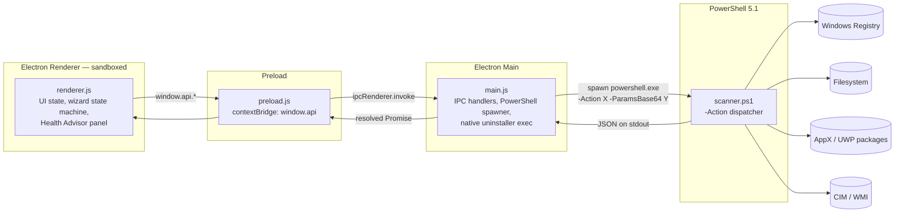
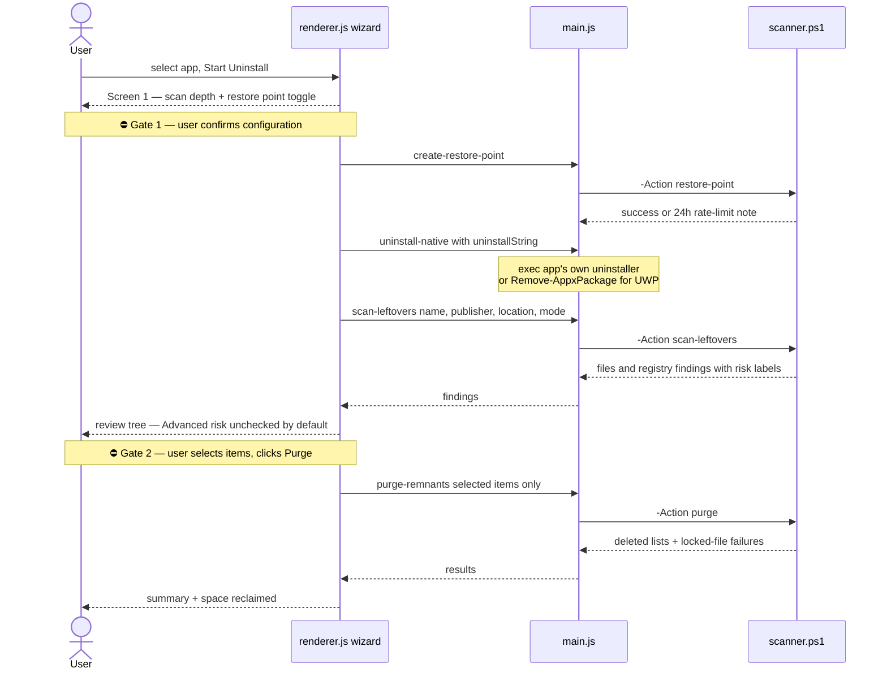

# Vanish — As-Built Architecture

*This document describes what the code does **today** (v0.2.x). The target-state design, including stages not yet implemented, lives in [docs/architecture.md](docs/architecture.md) and [docs/roadmap.md](docs/roadmap.md). Every box and arrow below maps to a real file and function.*

---

## 1. Component map

Four layers, strict one-way privilege escalation: the sandboxed renderer can only reach the OS through the typed preload bridge, the main process, and finally PowerShell.

**Security boundaries as configured** ([main.js](main.js) `createWindow`): `contextIsolation: true`, `nodeIntegration: false` — the renderer has no Node access; every OS capability is an explicit, named function on `window.api` ([preload.js](preload.js)). Parameters cross the Node→PowerShell boundary as Base64-encoded JSON to defeat shell-escaping issues ([main.js](main.js) `runPowerShell`, [scanner.ps1](scanner.ps1) param block). Elevation is detected via the `WindowsPrincipal` API, never `net session` ([scanner.ps1](scanner.ps1) `Check-AdminStatus`).

## 2. The approval-gated uninstall loop

The core pattern: **the tool proposes, the human disposes.** Two explicit human gates (marked ⛔) stand between "scan" and any deletion.

Wizard screens and step indicators are a declared state machine in [renderer.js](renderer.js) (`wizState.screens`: config → restore-loading → native-run → scan-loading → leftovers-tree → purge-loading → complete).

## 3. IPC surface (complete)

| `window.api` method | IPC channel | main.js handler | scanner.ps1 function |
|---|---|---|---|
| `getDesktopApps()` | `get-desktop-apps` | `runPowerShell('list-desktop')` | `Get-InstalledApps` |
| `getUwpApps()` | `get-uwp-apps` | `runPowerShell('list-uwp')` | `Get-UwpApps` |
| `createRestorePoint()` | `create-restore-point` | `runPowerShell('restore-point')` | `Create-RestorePoint` |
| `scanLeftovers(params)` | `scan-leftovers` | `runPowerShell('scan-leftovers', …)` | `Scan-Leftovers` |
| `purgeRemnants(remnants)` | `purge-remnants` | `runPowerShell('purge', …)` | `Purge-Remnants` |
| `uninstallNative(cmd)` | `uninstall-native` | `exec(uninstallString)` | — (native uninstaller) |
| `checkAdmin()` | `check-admin` | `runPowerShell('check-admin')` | `Check-AdminStatus` |
| `getSystemDiagnostics()` | `get-system-diagnostics` | `runPowerShell(…)` | `Get-SystemDiagnostics` |
| `getStartupItems()` | `get-startup-items` | `runPowerShell(…)` | `Get-StartupItems` |
| `getSoftwareRedundancy()` | `get-software-redundancy` | `runPowerShell(…)` | `Get-SoftwareRedundancy` |
| `minimizeWindow()` / `maximizeWindow()` / `closeWindow()` | `window-*` (send) | window controls | — |
| `openExternalLink(url)` | `open-external-link` (send) | `shell.openExternal` | — |

## 4. scanner.ps1 function inventory

| Function | Purpose | Notable safeguards |
|---|---|---|
| `Get-InstalledApps` | Enumerate desktop apps from 3 Uninstall hives | Filters SystemComponent, updates, hotfixes, parented keys |
| `Get-UwpApps` | Enumerate UWP packages, parse manifests for display names | Skips frameworks, system-signed, and runtime packages |
| `Create-RestorePoint` | `Checkpoint-Computer` APPLICATION_UNINSTALL | Admin check; Windows 24h rate limit treated as success-with-note |
| `Scan-Leftovers` | Find file/registry remnants at Safe / Moderate / Advanced depth | Publisher-sharing check (`Is-PublisherShared`) prevents proposing shared publisher folders; results deduplicated and existence-verified |
| `Purge-Remnants` | Delete selected paths and keys | Only acts on the passed-in selection; locked items collected in `failed*` lists, never forced |
| `Check-AdminStatus` | Elevation state via `WindowsPrincipal` | Replaces banned `net session` probe |
| `Get-SystemDiagnostics` | OS / CPU / RAM / GPU / disks / uptime via CIM | Narrow `SELECT` queries; every section fails soft |
| `Get-StartupItems` | Run/RunOnce keys + logon Scheduled Tasks + auto services | `exeExists` orphan flag; Microsoft-path services excluded; task scan capped at 80 |
| `Get-SoftwareRedundancy` | Group installed apps into 14 category clusters | Flags only categories with 2+ matches |

## 5. Implemented vs. designed

Status vocabulary follows promptgate Rule 10: **Implemented** means coded with a
passing local verification suite; it does **not** mean Complete. Nothing here is
Complete until the clean Windows 10 (1607+) and Windows 11 VM pass in TASK-17.

| Area | Status |
|---|---|
| Stage 1 — inventory, wizard, 3-mode scan, review-gated purge | ✅ Implemented ([scanner.ps1](scanner.ps1), [renderer.js](renderer.js)) |
| Stage 2 — Health Advisor (diagnostics, startup audit, redundancy) | ✅ Implemented (CHANGELOG 0.2.0) |
| Quarantine-first deletion vault | ✅ Implemented — `Invoke-QuarantineItems` / [lib/vault.js](lib/vault.js) / [lib/store.js](lib/store.js); the direct-delete purge is gone |
| Quarantine Manager tab (restore, Delete Forever, retention) | ✅ Implemented ([renderer.js](renderer.js) SCR-02) |
| Audit Mode enforced read-only tier + banner | ✅ Implemented — `fullModeOnly()` in [main.js](main.js) rejects every destructive channel; engine re-checks WindowsPrincipal |
| Startup elevation offer / relaunch | ⚠️ Implemented, UAC branches unverified — needs a human at the prompt (TASK-17) |
| Stage 3 — process monitor, unlocker, passive indicators, watchdog suspension | ✅ Implemented ([scanner.ps1](scanner.ps1) phase 2 block, SCR-03) |
| Stage 6 — bulk uninstall queue, switch chain, msiserver, restore-point override | ✅ Implemented ([lib/queue.js](lib/queue.js), [corrections.json](corrections.json)) |
| Stage 9 — registry views, context menus, services, PATH, associations, profile sweep | ✅ Implemented ([scanner.ps1](scanner.ps1) phase 4 block, SCR-05) |
| Driver Store package removal | 📐 Audit only — packages are listed but not removable; the sweeper is Stage 11 (Standard tier, Rule 16) |
| REQ-19 ownership elevator | ⚠️ Engine + UI done — per-item offer on the purge summary; acceptance test (TrustedInstaller-owned fixture) deferred to the VM pass |
| REQ-20 Force Uninstall for broken entries | ✅ Implemented — `Find-BrokenUninstallEntries` detects entries that cannot uninstall themselves; removal (including the uninstall key) routes through the vault |
| Settings / About tabs | ✅ Implemented — real panels ([index.html](index.html), [renderer.js](renderer.js)) |
| Zero runtime network I/O | ✅ Enforced — CSP names no external origin (`default-src 'self'`, `connect-src 'none'`); icons are first-party ([assets/icons.css](assets/icons.css)) and type is the OS stack |

*Version note: the repo follows a `RELEASE.MAJOR.MINOR` scheme defined in [docs/RELEASING.md](docs/RELEASING.md); current released state is 0.2.1 per [CHANGELOG.md](CHANGELOG.md).*
