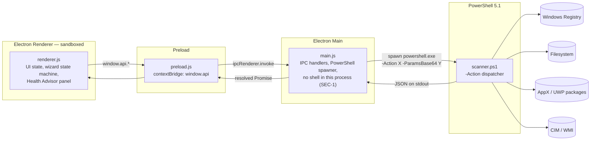
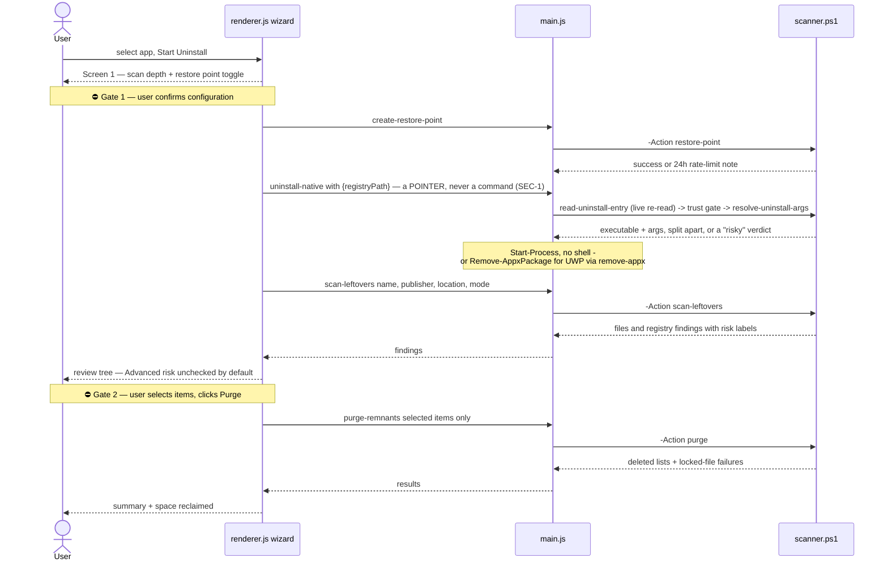

# Vanish — As-Built Architecture

*This document describes what the code does **today** (v0.3.x). The target-state design, including stages not yet implemented, lives in [docs/architecture.md](docs/architecture.md) and [docs/roadmap.md](docs/roadmap.md). Every box and arrow below maps to a real file and function.*

---

## 1. Component map

Four layers, strict one-way privilege escalation: the sandboxed renderer can only reach the OS through the typed preload bridge, the main process, and finally PowerShell.

**Security boundaries as configured** ([main.js](main.js) `createWindow`): `contextIsolation: true`, `nodeIntegration: false` — the renderer has no Node access; every OS capability is an explicit, named function on `window.api` ([preload.js](preload.js)). Parameters cross the Node→PowerShell boundary as Base64-encoded JSON to defeat shell-escaping issues ([main.js](main.js) `runPowerShell`, [scanner.ps1](scanner.ps1) param block). Elevation is detected via the `WindowsPrincipal` API, never `net session` ([scanner.ps1](scanner.ps1) `Check-AdminStatus`). `node:child_process`'s `exec` (a shell) is not imported anywhere in `main.js`; every process launch goes through `spawn` (the PowerShell bridge) or, inside `scanner.ps1`, `Start-Process -FilePath/-ArgumentList` with no shell attached (SEC-1, `test/security-verify.ps1` asserts this statically on every run).

## 2. The approval-gated uninstall loop

The core pattern: **the tool proposes, the human disposes.** Two explicit human gates (marked ⛔) stand between "scan" and any deletion.

Wizard screens and step indicators are a declared state machine in [renderer.js](renderer.js) (`wizState.screens`: config → restore-loading → native-run → scan-loading → leftovers-tree → purge-loading → complete).

## 3. IPC surface (complete)

Every destructive channel below is wrapped in `fullModeOnly()` ([main.js](main.js)): it is rejected outright, before its handler runs, unless the process resolved Full Mode at startup. `scanner.ps1` independently re-checks `WindowsPrincipal` inside every mutating function, so the tier boundary does not rely on `main.js` alone.

| `window.api` method | IPC channel | Destructive | main.js handler | scanner.ps1 function |
|---|---|---|---|---|
| `getDesktopApps()` | `get-desktop-apps` | | `runPowerShell('list-desktop')` | `Get-InstalledApps` |
| `getUwpApps()` | `get-uwp-apps` | | `runPowerShell('list-uwp')` | `Get-UwpApps` |
| `getWindowsFeatures()` | `get-windows-features` | | read-only, works in Audit Mode | `Get-WindowsFeatures` (`Win32_OptionalFeature`, not the DISM cmdlet, which requires elevation) |
| `createRestorePoint()` | `create-restore-point` | ✅ | `runPowerShell('restore-point')` | `Create-RestorePoint` |
| `scanLeftovers(params)` | `scan-leftovers` | | `runPowerShell('scan-leftovers', …)` | `Scan-Leftovers` |
| `purgeRemnants(remnants)` | `purge-remnants` | ✅ | `vault.quarantine(...)` — routes through the vault, never a direct delete (INV-1) | `Invoke-QuarantineItems` |
| `uninstallNative({type, registryPath \| packageFullName})` | `uninstall-native` | ✅ | `read-uninstall-entry` → trust gate → `resolve-uninstall-args` → `run-uninstaller`/`remove-appx`. Takes a **pointer**, never a command string (SEC-1) | `Read-UninstallEntry`, `Get-UninstallerTrust`, `Resolve-UninstallArgs`, `Invoke-Uninstaller`, `Remove-AppxPackageSafely` |
| `checkAdmin()` | `check-admin` | | `isFullMode()` (cached at startup) | `Check-AdminStatus` |
| `getTier()` | `get-tier` | | returns `{tier, isFullMode, offerElevation, bannerText}` | — |
| `relaunchElevated()` | `relaunch-elevated` | | `attemptElevatedRelaunch('user-click')`, shared with the automatic startup path | `relaunch-elevated` action (`Start-Process -Verb RunAs`) |
| `dismissElevationOffer()` | `dismiss-elevation-offer` | | clears `elevationOfferPending` | — |
| `vaultList()` | `vault-list` | | reads `manifest.json` via `lib/store.js` | — |
| `vaultRestore({entryId, onConflict})` | `vault-restore` | ✅ | `vault.restore(...)` | `Invoke-VaultRestore` |
| `vaultDelete({entryId})` | `vault-delete` | ✅ | `vault.deleteForever(...)` — the one irreversible action (INV-1) | `Invoke-VaultDelete` |
| `openVaultFolder()` / `openDataFolder()` | `open-vault-folder` / `open-data-folder` | | `shell.openPath(...)` | — |
| `getSettings()` / `setSettings(patch)` | `get-settings` / `set-settings` | | `lib/store.js` `readSettings`/`writeSettings`, schema-validated | — |
| `getAppInfo()` | `get-app-info` | | version, tier, data paths, vault size | — |
| `getSystemDiagnostics()` | `get-system-diagnostics` | | `runPowerShell(…)` | `Get-SystemDiagnostics` |
| `getStartupItems()` | `get-startup-items` | | `runPowerShell(…)` | `Get-StartupItems` |
| `getSoftwareRedundancy()` | `get-software-redundancy` | | `runPowerShell(…)` | `Get-SoftwareRedundancy` |
| `listProcesses(params)` | `list-processes` | | `runPowerShell(…)` | `Get-ProcessList` |
| `killProcess(params)` | `kill-process` | ✅ | `runPowerShell(…)`, oplogged | `Stop-VanishProcess` |
| `listLockers(params)` | `list-lockers` | | `runPowerShell(…)` | `Get-PathLockers` |
| `unlockPath(params)` | `unlock-path` | ✅ | `runPowerShell(…)`, oplogged | `Unlock-Path` (suspend-then-close via `ProcessFreezer`) |
| `queueGet()` | `queue-get` | | `queue.getState()` | — |
| `queueAdd(app)` / `queueRemove` / `queueClear` / `queueRetry` | `queue-*` | ✅ | `lib/queue.js` | — |
| `queueStart({acknowledgedIds})` | `queue-start` | ✅ | `queue.start(...)` — per-item live re-read + trust gate before each uninstall | `read-uninstall-entry`, `run-uninstaller` per item |
| `queuePause()` | `queue-pause` | ✅ | `queue.pause()` | — |
| `onQueueUpdate(cb)` | `queue-update` (main→renderer push) | | every state transition, not polled | — |
| `onScanProgress(cb)` | `scan-progress` (main→renderer push) | | interim scan state. `scanner.ps1` writes progress to **stderr** behind a marker so stdout stays pure JSON and no existing result contract can be corrupted; `main.js` parses it line-buffered and forwards to the requesting sender. Reports measured facts only — stages completed, seconds elapsed — never a predicted percentage (Rule 9) | `Write-ScanProgress` |
| `findBrokenEntries()` | `find-broken-entries` | | read-only, works in Audit Mode | `Find-BrokenUninstallEntries` |
| `cleanerScan(params)` | `cleaner-scan` | | read-only | `Invoke-CleanerScan` (context menus, services, drivers, PATH, associations, other profiles, left-over Store app data) |
| `getNetworkActivity(params)` | `get-network-activity` | | read-only | `Get-NetworkActivity` — adapter byte-counter deltas and connections by owning process. Opens no socket (INV-4) and reports no per-process byte rate, which Windows cannot attribute without an ETW trace |
| `startupAction(params)` | `startup-action` | ✅ | registry and service writes export a manifest-only `.reg` to the vault first | `Remove-StartupRegistryValue` / `Set-StartupServiceManual` / `Set-StartupTaskEnabled` |
| `cleanerPurge(params)` | `cleaner-purge` | ✅ | routes through the vault, same as `purge-remnants` | `Invoke-QuarantineItems` / `Set-PathEntries` |
| `minimizeWindow()` / `maximizeWindow()` / `closeWindow()` | `window-*` (send) | | window controls | — |
| `openExternalLink(url)` | `open-external-link` (send) | | `shell.openExternal` | — |

## 4. scanner.ps1 function inventory

Representative, not exhaustive — scanner.ps1 is ~3,100 lines. The table below covers the discovery functions from the original Core-tier build plus every function added since that changes what gets written to disk, the registry, or a process.

| Function | Purpose | Notable safeguards |
|---|---|---|
| `Get-InstalledApps` | Enumerate desktop apps from 3 Uninstall hives | Filters SystemComponent, updates, hotfixes, parented keys |
| `Get-UwpApps` | Enumerate UWP packages, parse manifests for display names | Skips frameworks, system-signed, and runtime packages |
| `Create-RestorePoint` | `Checkpoint-Computer` APPLICATION_UNINSTALL | Admin check; Windows 24h rate limit treated as success-with-note |
| `Scan-Leftovers` | Find file/registry remnants at Safe / Moderate / Advanced depth | Publisher-sharing check (`Is-PublisherShared`) prevents proposing shared publisher folders; results deduplicated and existence-verified |
| `Check-AdminStatus` | Elevation state via `WindowsPrincipal` | Replaces banned `net session` probe |
| `Get-SystemDiagnostics` | OS / CPU / RAM / GPU / disks / uptime via CIM | Narrow `SELECT` queries; every section fails soft |
| `Get-StartupItems` | Run/RunOnce keys + logon Scheduled Tasks + auto services | `exeExists` orphan flag; Microsoft-path services excluded; task scan capped at 80 |
| `Get-SoftwareRedundancy` | Group installed apps into 14 category clusters | Flags only categories with 2+ matches |
| `Test-VaultEntryId` / `Resolve-SafeVaultPath` | Validate manifest-supplied entry ids and relative paths before any join | Entry ids must be a UUIDv4; every resolved path is proven to still resolve inside its own entry folder (Vuln 1 fix) |
| `Test-ProtectedDestination` / `Resolve-DestinationTarget` | Refuse a vault restore into a privileged-execution location | Resolves junctions to their real target before judging, not just the literal path (SEC-2 fix) |
| `Invoke-QuarantineItems` / `Invoke-VaultRestore` / `Invoke-VaultDelete` | The vault pipeline: move-not-delete, `.reg` export/import, permanent removal | Per-item all-or-nothing; `Move-ItemTransactional` never leaves a half-moved item |
| `Set-VanishDataDirAcl` / `Test-VanishDataDirAcl` | Lock the state directory against the unprivileged user | Reassigns ownership recursively, not just the root; the health check inspects owners as well as the DACL (SEC-3 fix) |
| `Get-UninstallerTrust` / `Read-UninstallEntry` | Judge whether an uninstall entry could have been planted by a standard user | `HKCU` registration or a user-writable executable path both mark it `risky`; live-re-read at execution time, never the persisted string |
| `Invoke-Uninstaller` | Run one uninstaller and report exit code / timeout / interactivity | `Start-Process -FilePath/-ArgumentList`, no shell; refuses a `risky` entry without explicit acknowledgement |
| `ConvertTo-ProcessArgument(List)` | Quote an elevated relaunch's argument vector | Implements the real `CommandLineToArgvW` rules, not naive quote-wrapping (TASK-05 fix; a trailing backslash or embedded quote breaks the naive version) |
| `Stop-VanishProcess` / `Unlock-Path` / `ProcessFreezer` | Task Manager kill + file-lock holder discovery/close | `NtSuspendProcess`/`NtResumeProcess` hold handles open from discovery through thaw so a recycled PID is never mistakenly resumed or killed |
| `Invoke-CleanerScan` (context menus, services, drivers, PATH, associations, profiles, left-over Store app data) | System Clean discovery across 7 categories | Audit-only for driver packages (Standard tier, Rule 16); other-profile sweep loads hives offline and always unloads in `finally` |
| `Find-BrokenUninstallEntries` | Detect entries whose uninstaller can no longer run itself | Read-only; the fallback used by Force Uninstall before it resorts to a manifest-only removal |

## 5. Implemented vs. designed

Status vocabulary follows promptgate Rule 10: **Implemented** means coded with a
passing local verification suite; it does **not** mean Complete. Nothing here is
Complete until the clean Windows 10 (1607+) and Windows 11 VM pass in TASK-17.

| Area | Status |
|---|---|
| Stage 1 — inventory, wizard, 3-mode scan, review-gated purge | ✅ Implemented ([scanner.ps1](scanner.ps1), [renderer.js](renderer.js)) |
| Stage 2 — Health Advisor (diagnostics, startup audit, redundancy) | ✅ Implemented (CHANGELOG 0.2.0) |
| Quarantine-first deletion vault | ✅ Implemented — `Invoke-QuarantineItems` / [lib/vault.js](lib/vault.js) / [lib/store.js](lib/store.js); the direct-delete purge is gone |
| Quarantine Manager tab (restore, Delete Forever, retention) | ✅ Implemented ([renderer.js](renderer.js) SCR-02) |
| Audit Mode enforced read-only tier + banner | ✅ Implemented — `fullModeOnly()` in [main.js](main.js) rejects every destructive channel; engine re-checks WindowsPrincipal |
| Startup elevation offer / relaunch, plus an opt-in "start elevated automatically" setting | ⚠️ Implemented, UAC branches unverified — needs a human at the prompt (`vanish-uninstaller-69a`) |
| Stage 3 — process monitor, unlocker, passive indicators, watchdog suspension | ✅ Implemented ([scanner.ps1](scanner.ps1) phase 2 block, SCR-03) |
| Stage 6 — bulk uninstall queue, switch chain, msiserver, restore-point override | ✅ Implemented ([lib/queue.js](lib/queue.js), [corrections.json](corrections.json)) |
| Stage 9 — registry views, context menus, services, PATH, associations, profile sweep | ✅ Implemented ([scanner.ps1](scanner.ps1) phase 4 block, SCR-05) |
| Driver Store package removal | 📐 Audit only — packages are listed but not removable; the sweeper is Stage 11 (Standard tier, Rule 16) |
| REQ-19 ownership elevator | ⚠️ Engine + UI done — per-item offer on the purge summary; acceptance test (TrustedInstaller-owned fixture) deferred to the VM pass |
| REQ-20 Force Uninstall for broken entries | ✅ Implemented — `Find-BrokenUninstallEntries` detects entries that cannot uninstall themselves; removal (including the uninstall key) routes through the vault |
| Settings / About tabs | ✅ Implemented — real panels ([index.html](index.html), [renderer.js](renderer.js)) |
| Zero runtime network I/O | ✅ Enforced — CSP names no external origin (`default-src 'self'`, `connect-src 'none'`); icons are first-party ([assets/icons.css](assets/icons.css)) and type is the OS stack |
| Data directory moved out of the shared Electron/Chromium profile | ✅ Implemented — state lives in a `vanish-state` subdirectory nothing but Vanish writes, migrated once from any earlier layout ([lib/store.js](lib/store.js); the shared-profile ACL conflict this fixes is `vanish-uninstaller-z2a`) |
| `/cso` security audit — command injection, restore-destination guard, data-dir ACL, dependency pinning | ✅ Fixed — see the **Security** section of [CHANGELOG.md](CHANGELOG.md); `vanish-uninstaller-lwz`/`2xt`/`z2a`/`703` |
| DOM-level UI test coverage of the main flows (wizard, quarantine, queue, System Clean) | ✅ Implemented — `test/ui-interaction-verify.js` + `test/ui-interaction-full-verify.js`, hit-testing the real clickable target rather than the engine/IPC layer alone (`vanish-uninstaller-7y0`) |
| Verification against real machine state | ✅ Implemented — `test/real-data-verify.js` (`vanish-uninstaller-7oo.10`). The suites above all drive `test/fixtures/stub-preload.js`: one fake application, clean fields, instant responses. That gap is not academic — it is how 312/312 stayed green while 60 of 151 installed programs were invisible, Storage had never once rendered, and the uninstall buttons sat 250px below the window. This harness runs the real preload against the real backend, takes its ground truth from an independent PowerShell probe (`test/fixtures/real-machine-truth.ps1`) so it cannot merely agree with the code under test, and prints what it could **not** verify at the end of every run. `main.js` honours `VANISH_HEADLESS_HARNESS=1` (development builds only) so no diagnostic can spawn a window mistakable for the app |

*Version note: the repo follows a `RELEASE.MAJOR.MINOR` scheme defined in [docs/RELEASING.md](docs/RELEASING.md). Last tagged release is 0.2.1 per [CHANGELOG.md](CHANGELOG.md); everything in this document beyond that — the entire quarantine vault, both elevation tiers, Stages 2/3/6/9, Force Uninstall, and the `/cso` fixes — is unreleased work-in-progress at working version 0.3.0 (`package.json`), gated on the TASK-17 VM pass before it tags.*
