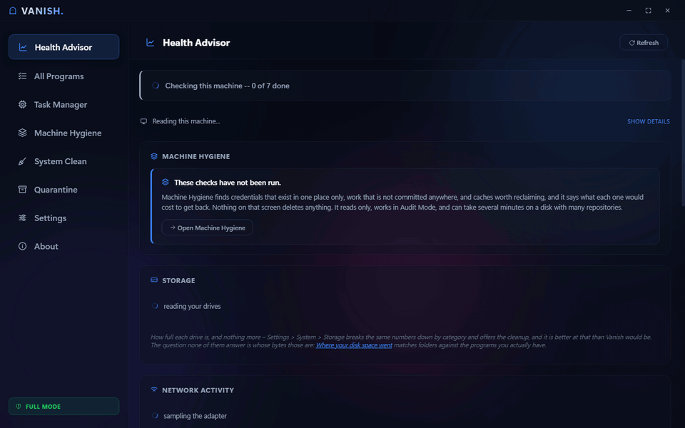

# Vanish

**A premium CCleaner for developers and digital hygienists — on-device, approval-gated, and reversible by default.**

Vanish opens on a **Health Advisor** dashboard: what this machine is, where the disk went, what starts with Windows, what holds a network connection, what is listening, what is installed twice. From there it maps every installed application (desktop + Microsoft Store), walks you through clean uninstalls with a native-uninstaller-first wizard, hunts the leftovers uninstallers abandon, and **quarantines everything it removes so it can be put back**. Everything runs locally. Nothing leaves your machine.

The "for developers" part is not decoration. A general-purpose cleaner does not know that `node_modules` is disposable and a `.jks` keystore is not, that an unpushed branch exists nowhere else in the world, or that a stash is invisible to every other tool you own. Vanish leads with **what a delete would destroy** and only then with what it would free — see [Rescue before reclaim](#rescue-before-reclaim).

> Working version **0.9.0**, verified locally with `npm test`. Versions track milestones and keep moving past 1.0 — see [docs/RELEASING.md](docs/RELEASING.md). 1.0 is the release that meets the gates in [docs/PRE-RELEASE.md](docs/PRE-RELEASE.md), not a finish line. Read [Status](#status) before you rely on this.

<!-- DEMO GIF PLACEHOLDER
Record with ScreenToGif: 30–60s showing scan → app select → wizard →
leftover review tree → purge summary. Replace this block with:

-->
> 📸 *Demo GIF coming — see [docs/RELEASING.md](docs/RELEASING.md) for the release checklist.*

---

## Why this exists

Windows in 2025–26 accumulates weight quietly: telemetry-heavy background services, autostart entries that outlive the apps that created them, and uninstallers that routinely leave megabytes of files and dozens of registry keys behind. The existing tool landscape splits into two bad camps — "cleaners" that delete aggressively on vague heuristics, and manual registry surgery.

Vanish takes a third path: **audit first, propose second, act only on explicit approval.** It is built on the conviction that a tool touching your registry should show you exactly what it found, why it thinks it's a leftover, how risky removal is — and then wait.

## The loop

Every destructive workflow in Vanish follows the same pattern, implemented as a 7-screen wizard state machine in [renderer.js](renderer.js):

```
scan  →  detect  →  propose  →  await approval  →  act (quarantine)  →  report
```

1. **Scan** — enumerate apps from the registry Uninstall hives (64-bit, 32-bit, per-user) and UWP packages ([scanner.ps1](scanner.ps1) `Get-InstalledApps`, `Get-UwpApps`).
2. **Detect** — after the app's *own* uninstaller runs, sweep the filesystem and registry for remnants in one of three user-selected depths (`Scan-Leftovers`).
3. **Propose** — present every finding in a review tree with a per-item risk label (Safe / Moderate / Advanced). Advanced-risk items are **unchecked by default** ([renderer.js](renderer.js) `renderLeftoversTree`).
4. **Await approval** — nothing moves until you review the list and click Purge. Unchecking everything and finishing without purging is a first-class path.
5. **Act & report** — the checked items are quarantined, not deleted: files move into a versioned vault and registry keys are exported to a `.reg` restore manifest *before* anything is removed. Anything locked by Windows is reported as skipped, never forced. Every quarantined item can be restored from the Quarantine Manager tab, or permanently deleted behind a typed double-confirmation.

This same scan → propose → quarantine pattern is how every other destructive surface in the app works too — the bulk uninstall queue, System Clean's seven cleaners, Force Uninstall for broken entries. There is exactly one route to the disk or the registry for a removal ([lib/vault.js](lib/vault.js)), and it is this one.

## What it does

| Capability | Where it lives |
|---|---|
| Desktop app inventory across HKLM / HKCU / Wow6432Node hives, with size + install date | [scanner.ps1](scanner.ps1) `Get-InstalledApps` |
| UWP / Store app inventory with `AppxManifest.xml` friendly-name parsing | [scanner.ps1](scanner.ps1) `Get-UwpApps` |
| System Restore Point before any uninstall (default-on, handles the Windows 24-hour rate limit) | [scanner.ps1](scanner.ps1) `Create-RestorePoint` |
| Native-uninstaller-first flow — Vanish resolves and launches the app's own uninstaller before touching anything, with a live registry re-read and a trust check on every run | [main.js](main.js) `uninstall-native` |
| Three-depth leftover scanning with publisher-folder protection (shared publisher folders are never proposed for whole-folder deletion) | [scanner.ps1](scanner.ps1) `Scan-Leftovers` |
| Quarantine vault — every removal is reversible until you say otherwise | [lib/vault.js](lib/vault.js), [lib/store.js](lib/store.js), Quarantine Manager tab |
| Audit Mode / Full Mode elevation tiers — the app is read-only until elevated, with a persistent banner and every destructive control inert and explained | [main.js](main.js) `fullModeOnly()` |
| Task Manager & file-lock unlocker — see what has a file open and close it (or suspend the tree) before retrying | [scanner.ps1](scanner.ps1) `Get-ProcessList`, `Unlock-Path` |
| Bulk uninstall queue — restore point, silent-switch resolution, and an untrusted-uninstaller acknowledgement gate, per app | [lib/queue.js](lib/queue.js) |
| System Clean — orphaned context menus, services, dead PATH entries, broken file associations, other-profile remnants; driver packages are audited but not yet removable | [scanner.ps1](scanner.ps1) `Invoke-CleanerScan` |
| Left-over Store app data — `%LOCALAPPDATA%\Packages` folders whose package is no longer installed anywhere on the machine, with Windows' own families listed but never removable and anything touched in the last week held back | [scanner.ps1](scanner.ps1) `Find-UwpLeftovers` |
| Force Uninstall — detects and removes entries that can no longer uninstall themselves, still routed through the vault | [scanner.ps1](scanner.ps1) `Find-BrokenUninstallEntries` |
| Health Advisor -- the landing page: CIM-based system diagnostics (OS, CPU, RAM, GPU, disks, uptime), with each section rendering as its own query answers rather than all of them waiting on the slowest | [scanner.ps1](scanner.ps1) `Get-SystemDiagnostics`, [renderer/audit.js](renderer/audit.js) |
| Machine Hygiene -- thirteen audit-only checks across rescue / hygiene / reclaim, each its own engine call, with one named terminal state per run and no verdict at all until every check is back | [finders/](finders/), [lib/findings.js](lib/findings.js), [renderer/hygiene.js](renderer/hygiene.js) |
| Network activity — which programs hold connections, and a verdict including "nothing on this PC is using the network". Reads local byte counters only; it never opens a socket, and never claims a per-program byte rate Windows cannot attribute | [scanner.ps1](scanner.ps1) `Get-NetworkActivity` |
| Hold background transfers — caps Windows Update's background downloading and pauses running background transfers, with every changed setting written to disk before it is touched, and released automatically if Vanish closes or crashes while a hold is on | [scanner.ps1](scanner.ps1) `Invoke-NetworkHoldApply` |
| Startup audit: Run/RunOnce keys, logon-triggered Scheduled Tasks, auto-start services — with **orphan detection** (entries whose executable no longer exists) | [scanner.ps1](scanner.ps1) `Get-StartupItems` |
| Software redundancy detection: 14 category clusters (browsers, PDF readers, AV tools…) flagging duplicate installs | [scanner.ps1](scanner.ps1) `Get-SoftwareRedundancy` |
| Search, type filter, sort (name/size/date), and column filters -- click a header, pick which Publishers or Types to show -- over the full app inventory | [renderer/core.js](renderer/core.js) `filterAndRenderApps`, [renderer/column-filter.js](renderer/column-filter.js) |

### Watch an install, and see what it left behind

Two features that only make sense together, both in **System Clean**:

- **Watch an install** takes a reading of your Run keys, program folders,
  services and uninstall entries, waits while *you* run an installer, then takes
  a second reading and reports the difference in real numbers. It is a
  comparison, not a recording — it says so — and it installs nothing itself.
- **Where your disk space went** matches every top-level program folder against
  the programs actually installed. Folders a watched install created whose
  program is now gone are named as **left behind**. Everything else Vanish
  cannot explain is listed as **unexplained**, separately, and never presented
  as rubbish.

That distinction is the whole point. Every disk-usage tool can tell you a folder
is 12 GB; none of them can tell you whose it was, because none of them has an
uninstall database. And a tool that guesses would eventually put a delete button
next to something you needed.

## Rescue before reclaim

The machine-hygiene suite is audit-only: it reports, and removes nothing. It was
built in the order that earns trust rather than the order that frees the most
space, because **a tool that cannot yet delete anything, but can tell you what a
delete would destroy, is already the most useful thing on the machine.**

| Check | What only this can tell you |
|---|---|
| **Local-only credentials** | Files that are on your disk, are gitignored, and are therefore on no remote anywhere -- `key.properties`, `.env.local`, `*.jks`, `*.keystore`. Vanish never reads them; it reports the path, the size, and git's own verdict. A signed Android app whose keystore is gone can never be updated under the same listing again. |
| **What a re-clone would not bring back** | Uncommitted changes, unpushed commits, branches with no upstream, and **stashes** -- which are invisible to every other check and are pure local-only work. That set is the real blast radius of "just re-clone it". |
| **Duplicate build output** | Directories identical by content hash, not by name. |
| **Toolchain consumers** | Who would break if a runtime went. |

Every one of these is a claim about *this* machine, computed from local
evidence. None of them is a heuristic about what a folder is called.

## Scan modes

| Mode | Filesystem | Registry | Default in review tree |
|---|---|---|---|
| **Safe** | `InstallLocation` + exact-name folders only | Exact `Publisher\App` and `App` key paths | Checked |
| **Moderate** | Partial-name matches in ProgramFiles / ProgramData / AppData; publisher folders only when no other installed app shares the publisher | Top-two-level key matches with the same publisher-sharing guard | Checked (publisher folders labeled Moderate) |
| **Advanced** | Wildcard + whitespace-stripped matching, adds `%TEMP%` | Same as Moderate | **Unchecked** — you opt in per item |

Discovery depth and deletion are independent: you can scan Advanced and still delete nothing.

## What Vanish does NOT do

- **No telemetry, no network calls.** There is no analytics code and no cloud lookup anywhere in the codebase. The CSP names no external origin (`connect-src 'none'`) — verify with a grep, don't take the README's word for it.
- **No autonomous deletion.** No scheduler, no background service, no "auto-clean" — with one narrow, explicit exception: an *optional* setting to permanently purge quarantined items past a retention period at app start, off by default. Every other removal traces to a checkbox you ticked that session.
- **Not an antivirus.** Vanish surfaces information; it makes no threat judgments.
- **No silent auto-elevation.** Vanish can be set to *ask* Windows for elevation automatically at startup instead of waiting for a click (Settings → "Start Vanish as administrator", off by default) — but Windows' own UAC consent prompt still appears on every single launch either way. There is no path in this codebase that skips it.
- **Driver package removal is audit-only** in this release. Third-party driver packages with a missing INF are listed, not removed — that sweeper is scoped for the Standard tier, not Core.

## Status

Status vocabulary follows this project's own **promptgate Rule 10**: *Implemented* means coded with a passing local verification suite; it does **not** mean *Complete*. For 1.0 the clean-VM gate was **waived deliberately** rather than met — see [Known limitations](#known-limitations) — so treat everything below as "works on the machines it was built and used on," not "certified everywhere."

**Implemented and locally verified (working version 0.9.0):**
- Quarantine-first removal for every destructive path — files move into a versioned vault, registry keys export to a `.reg` restore manifest, *before* anything is removed ([lib/vault.js](lib/vault.js))
- Audit Mode / Full Mode elevation tiers enforced independently in both the main process and the PowerShell engine — a destructive action reachable only through a channel neither layer gates has not been found ([main.js](main.js) `fullModeOnly()`, [scanner.ps1](scanner.ps1) `Test-IsElevated`)
- Restore point before uninstall, on by default, admin-gated ([scanner.ps1](scanner.ps1) `Create-RestorePoint`)
- The app's own uninstaller always runs first, resolved through a live registry re-read with a trust check — no command string ever crosses the renderer→main boundary ([main.js](main.js) `uninstall-native`)
- Per-item review with risk labels; Advanced findings opt-in only ([renderer.js](renderer.js))
- Shared publisher folders protected from whole-folder deletion ([scanner.ps1](scanner.ps1) `Is-PublisherShared`)
- Locked files reported and skipped, never forced; a Task Manager + unlocker tab can close or suspend the holder first
- A bulk uninstall queue, a System Clean pass across seven leftover categories, and Force Uninstall for entries that can no longer uninstall themselves — all routed through the same vault
- Elevation state detected via the `WindowsPrincipal` API, never `net session`
- Thirteen machine-hygiene checks across rescue / hygiene / reclaim, all audit-only, each computing one of three states from evidence rather than asserting one, and a decider that turns the set into exactly one named terminal state ([finders/](finders/), [lib/findings.js](lib/findings.js))
- A `/cso` security audit found and fixed four issues in the destructive paths (command injection, a restore-destination guard bypassable by a directory junction, an ACL fix that didn't survive the app's own normal startup order, and an untracked lockfile) — see the **Security** section of [CHANGELOG.md](CHANGELOG.md)

**Not yet done, honestly:**
- **Machine Hygiene takes about a minute and a half.** All thirteen checks measured **103 seconds** end to end on the machine it was built on — they walk your profile and hash file contents, so this scales with how much is on your disk. It was over ten minutes before 0.9.1, with one check that never finished at all. The floor now is a single check (duplicate content) at 56 seconds, and getting under that needs the checks to share one walk of the disk rather than taking four.
- The UAC accept/decline/cancel branches of both the startup elevation offer and the auto-elevate setting — these need a human at the actual consent prompt, which cannot be automated
- Six elevated confirmations of already-built features (startup actions, Store-leftover purge/restore, network hold revert, Force Uninstall acceptance) — see `bd list` for the current set
- Driver Store package *removal*. This one is not "not yet" — it is **cut**, deliberately: `pnputil /delete-driver` destroys the copy a restore would need, so Vanish cannot promise reversibility there, and `pnputil` and Disk Cleanup already do the job. Listing works today and stays.

See [ARCHITECTURE.md](ARCHITECTURE.md) §5 for the full implemented-vs-designed table.

## Known limitations

Three release gates were waived for 1.0 by deliberate decision, not oversight.
Each has a real cost and it belongs here rather than in a commit message —
an app whose whole argument is "we tell you what we actually know" does not
get to be vague about its own shipping standard.

| Waived | What it means for you |
| --- | --- |
| **The binary is unsigned** | Windows SmartScreen will show "Windows protected your PC" on any machine other than the developer's. You have to click through it. There is no code-signing certificate for this release. |
| **No clean-VM acceptance pass** | Vanish has not been tested on a fresh Windows 10 or Windows 11 install. Breakage specific to clean machines — missing runtimes, different UAC defaults, no developer tooling present — would not have been caught. |
| **Single-user acceptance** | One person has used this end to end: the person who wrote it. Every "works" claim carries that caveat. |
| **Machine Hygiene takes ~103 seconds** | Measured on the machine it was built on, for all thirteen checks. It scales with the size of your profile, and one check accounts for over half of it. The screen shows which check is working and findings appear as they land, so the wait is legible — but it is still a wait. |

The first two reverse the moment there is a certificate and a VM run; the
third reverses the moment someone else uses it. Reopen `1w0` and `442` in the
issue tracker if you are that someone.


## Quickstart

Requirements: Windows 10 (1607+) or Windows 11 · PowerShell 5.1+ (bundled with Windows) · Node.js 20+

```powershell
# In an elevated PowerShell (admin rights are needed for restore points,
# HKLM cleanup, and most of the app; unelevated runs are read-only Audit Mode):
git clone https://github.com/QuantumMonkey/Vanish
cd Vanish
npm ci
npm start

# Run the local verification suite (314/314 unelevated; 2 of 14 suites need
# Full Mode - run from an elevated shell for the full picture):
npm test

# Run it against YOUR machine, with the real engine and real data. Slower,
# read-only, and the one that matters - see below:
npx electron test/real-data-verify.js
```

### Two kinds of test, and why the second one exists

`npm test` drives a fixture: one fake application, clean fields, instant
responses. It is fast, it runs anywhere, and on 2026-08-06 it reported
**312 of 312 passing while the app was visibly broken** — 60 of 151 installed
programs invisible, the Storage panel rendering nothing at all, and the
uninstall buttons sitting 250px below the bottom of the window. Fixture-shaped
tests validate fixture-shaped reality.

`test/real-data-verify.js` runs the real preload against the real backend on
the machine you are sitting at, and asserts what a user would actually see.
Its ground truth comes from `test/fixtures/real-machine-truth.ps1`, which
queries the machine with its own independent queries — a harness that asks the
code under test what reality looks like can only ever agree with itself. It
prints what it could **not** verify at the end of every run.

```powershell
npx electron test/real-data-verify.js                      # everything
npx electron test/real-data-verify.js --only=storage,force  # named sections
npx electron test/real-data-verify.js --sweep               # 800x600, 1080x720, 1440x900
npx electron test/real-data-verify.js --plant               # proves broken-entry detection
```

It is deliberately outside `npm test`: it is slow, its results depend on what
is installed, and its failures are meant to be read rather than counted.
`--plant` creates one clearly-named broken uninstall entry under HKCU and
removes it again; everything else is read-only.

## Documentation

- [ARCHITECTURE.md](ARCHITECTURE.md) — **as-built** components, IPC surface, and the approval-loop sequence (start here)
- [docs/PRE-RELEASE.md](docs/PRE-RELEASE.md) — **the single source of truth for scope**: what is in 1.0, what is cut and why, what comes after
- [docs/roadmap.md](docs/roadmap.md) · [docs/architecture.md](docs/architecture.md) — historical design records, superseded for scope 2026-08-12 · [docs/history/](docs/history/) — archived session handoffs, not to-do lists
- [docs/promptgate.md](docs/promptgate.md) — the development rulebook every change must pass
- [CHANGELOG.md](CHANGELOG.md) · [docs/RELEASING.md](docs/RELEASING.md) · [docs/BENCHMARKS.md](docs/BENCHMARKS.md)

## License

[MIT](LICENSE)

---

*This is the same pattern I use for GTM systems — an agent that watches, diagnoses, and proposes fixes before you notice the problem. I'm building the GTM version next.*
