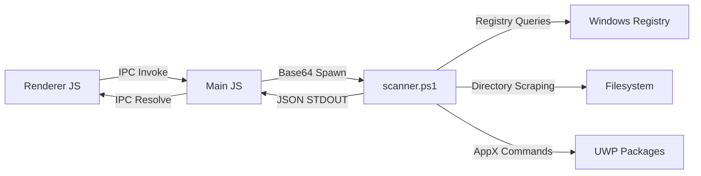

# Vanish: Architecture Specification

Vanish is a modern, lightweight Windows application manager and deep-cleaning uninstaller. It utilizes an Electron-based host executing a high-performance, non-blocking asynchronous PowerShell backend.

---

## Technical Stack

* **Frontend**: HTML5, Vanilla CSS3 (Custom Orbit Glassmorphic Dark Theme), ES6 Javascript.
* **Host Process**: Electron Node.js runtime, managing window frames and system IPC.
* **Execution Engine**: Windows PowerShell 5.1+ spawned via Node `child_process`.
* **Communication Channel**: Base64 JSON-encoded payload marshalling via standard input/output (stdin/stdout) to bypass shell character escaping constraints.

---

## System Architecture

### 1. App Mapping Subsystem
Vanish maps installed programs by scanning target registry keys in both 32-bit and 64-bit hives:
* `HKLM:\Software\Microsoft\Windows\CurrentVersion\Uninstall\*`
* `HKLM:\Software\Wow6432Node\Microsoft\Windows\CurrentVersion\Uninstall\*`
* `HKCU:\Software\Microsoft\Windows\CurrentVersion\Uninstall\*`

For UWP (Windows Store) applications, it runs `Get-AppxPackage` and parses the corresponding XML manifests for friendly name metadata.

### 2. Deep-Clean Scanner
Leftovers are located using a search heuristic based on three modes:
* **Safe**: Matches exact installer GUIDs and folder paths listed under the `InstallLocation` registry parameter.
* **Moderate**: Scans common paths (`ProgramFiles`, `ProgramData`, `AppData`) for folders containing the application or publisher name. Shares are protected: if a publisher has multiple active programs installed, the parent publisher folder is preserved.
* **Advanced**: Performs wildcard name scans, common temporary folder scans (`$env:TEMP`), and searches second-level registry subkeys under `Software` for keyword remnants.

---

## Performance & Resource Targets

* **Application Listing Startup Time**: < 1.8 seconds (Cached, non-blocking size calculation).
* **PowerShell Execution Overhead**: < 120ms launch latency.
* **Memory Utilization (Idle)**: < 65MB.
* **Memory Utilization (Scanning)**: < 95MB.
* **Registry Scan Throughput**: ~250 subkeys/second (restricted to top 2 levels under `Software` for speed).

---

## Windows Backwards Compatibility

Vanish offers robust backwards compatibility across Windows OS versions:
* **Windows 10 & 11**: 100% feature parity, including UWP uninstallation, restore point creation, and administrative registry queries.
* **Windows 7, 8 & 8.1**: Desktop program uninstallation and registry cleaning work fully. UWP mapping is skipped automatically on these systems by checking for the existence of `Get-AppxPackage` or checking the Windows kernel version.
* **Requirements**: Windows PowerShell 5.1 (bundled by default since Windows 7 SP1).

---

## Document Version History

| Version | Date | Author | Description of Changes |
| :--- | :--- | :--- | :--- |
| v1.0.0 | 2026-06-26 | Antigravity AI | Initial architectural draft for Electron + PowerShell integration. |
