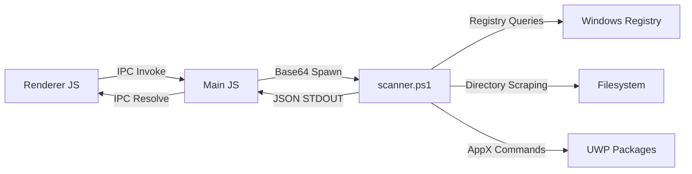

# Vanish: Architecture Specification

Vanish is a modern, lightweight Windows application manager and deep-cleaning uninstaller. It utilizes an Electron-based host executing a high-performance, non-blocking asynchronous PowerShell backend.

---

## Technical Stack

* **Frontend**: HTML5, Vanilla CSS3 (Custom Orbit Glassmorphic Dark Theme), ES6 Javascript.
* **Host Process**: Electron Node.js runtime, managing window frames and system IPC.
* **Execution Engine**: Windows PowerShell 5.1+ spawned via Node `child_process`.
* **Communication Channel**: Base64 JSON-encoded payload marshalling via standard input/output (stdin/stdout) to bypass shell character escaping constraints.

---

## 🤖 AI, ML, Automation & Agent Integration

Vanish prioritizes predictability, performance, and transparency for system-level modifications. Therefore:
* **Machine Learning & AI Models**: No heavy local machine learning models or neural networks are bundled with the client application. Running local AI models would bloat the application package by gigabytes and spike memory/CPU utilization. Instead, Vanish uses deterministic rule-based matching, regex heuristics, YARA signatures, and structured XML databases (CleanerML). Any future AI/ML auditing features will be lightweight, optional, or delegated to an external API.
* **Autonomous Agents**: Vanish does not employ autonomous agents inside the host OS for execution. All operations (uninstall queues, registry cleaning, handle closures) follow deterministic state machines to ensure predictable execution and prevent unauthorized filesystem modifications.
* **Engineering & Automation**:
  * **Automated Rollbacks**: Automated snapshot generation (filesystem and registry diffing) before/after third-party installations.
  * **Automated Locker Resolver**: Real-time handle inspection (Restart Manager API) and automated process tree freezing (`NtSuspendProcess`) before releasing resource locks.
  * **Silent Orchestration**: Sequential scheduling and silent parameter configuration for multiple installers with dynamic `msiserver` state management.
  * **System Environment Cleanup**: Automated path checks, orphaned service scans, and inactive profile registry sweeps (`reg.exe load`).

---

## System Architecture

### 1. App Mapping Subsystem
Vanish maps installed programs by scanning target registry keys in both 32-bit and 64-bit hives:
* `HKLM:\Software\Microsoft\Windows\CurrentVersion\Uninstall\*`
* `HKLM:\Software\Wow6432Node\Microsoft\Windows\CurrentVersion\Uninstall\*`
* `HKCU:\Software\Microsoft\Windows\CurrentVersion\Uninstall\*`

For UWP (Windows Store) applications, it runs `Get-AppxPackage` and parses the corresponding XML manifests for friendly name metadata.

### 2. Deep-Clean Scanner
Leftovers are located using a search heuristic based on three modes:
* **Safe**: Matches exact installer GUIDs and folder paths listed under the `InstallLocation` registry parameter.
* **Moderate**: Scans common paths (`ProgramFiles`, `ProgramData`, `AppData`) for folders containing the application or publisher name. Shares are protected: if a publisher has multiple active programs installed, the parent publisher folder is preserved.
* **Advanced**: Performs wildcard name scans, common temporary folder scans (`$env:TEMP`), and searches second-level registry subkeys under `Software` for keyword remnants.

---

## 🛡️ Counter-Malware & Threat Auditing Architecture

Vanish integrates a passive threat auditing engine rather than a real-time, kernel-level antivirus (which would require complex, resource-heavy ELAM or Minifilter drivers). The threat auditing architecture focuses on:
1. **Behavioral Heuristics (Process Spawning)**: Monitors active process trees in the Task Manager layer to flag suspicious behaviors (e.g., office applications spawning command interpreters, or programs executing shadow copy deletion commands like `vssadmin delete shadows`).
2. **Persistence Path Auditing**: Scans known persistence hooks (Registry Run keys, Task Scheduler, AppInit_DLLs, Winlogon Shell entries) to list and alert users of unrecognized startup executables.
3. **File Integrity & Digital Signatures**: Executes cryptographic hashing (MD5/SHA256) and verifies Authenticode digital signatures on target DLLs/EXEs to detect injection, tempering, or corrupt binaries.
4. **Directory Pattern Scanning (YARA)**: Bundles precompiled YARA rule engines to run lightweight, on-demand signature scans over application directories during deep uninstallation scans.

---

## Performance & Resource Targets

Vanish maintains a lightweight, non-intrusive system footprint.
* **Application Listing Startup Time**: < 1.8 seconds (Cached, non-blocking size calculation).
* **PowerShell Execution Overhead**: < 120ms launch latency.
* **Memory Footprint**:
  * **Idle**: < 65MB.
  * **Scanning & Unlocking**: < 95MB.
  * **Peak (Real-time sandbox tracking)**: < 110MB.
* **CPU Utilization**:
  * **Idle**: ~0% CPU.
  * **Active Deep Scanning**: < 15% on modern multi-core CPUs due to non-blocking asynchronous IO.
* **Disk I/O**: Heavy reads are throttled and restricted to designated app directories to prevent system stuttering.
* **Registry Scan Throughput**: ~250 subkeys/second (restricted to top 2 levels under `Software` for speed).
* **Application Package Size**: < 80MB (fully packaged Electron application).

---

## 🖥️ Windows OS Support Policy

Vanish exclusively targets modern, active Windows operating systems to maximize security and access advanced API sets:
* **Supported OS Versions**: Windows 10 (1607+) and Windows 11.
* **Legacy Systems (Windows 7 / 8 / 8.1)**: Excluded from support. Modern versions of Chromium and Electron (v23+) have dropped support for these operating systems, meaning the frontend framework will not execute. Additionally, these systems represent under 3% of active installations.
* **Minimum PowerShell Version**: PowerShell 5.1 (bundled natively with all supported Windows 10 & 11 versions). By establishing PS 5.1 as the baseline, Vanish avoids legacy `Get-WmiObject` commands in favor of faster `Get-CimInstance` cmdlets and relies on robust, native AppX package queries.

---

## Document Version History

| Version | Date | Author | Description of Changes |
| :--- | :--- | :--- | :--- |
| v1.0.0 | 2026-06-26 | Antigravity AI | Initial architectural draft for Electron + PowerShell integration. |
