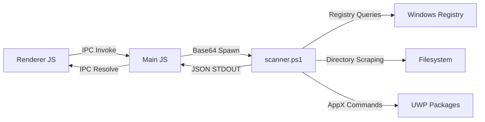

# Vanish: Architecture Specification

Vanish is a modern, lightweight Windows application manager and deep-cleaning uninstaller. It utilizes an Electron-based host executing a high-performance, non-blocking asynchronous PowerShell backend.

---

## Technical Stack

* **Frontend**: HTML5, Vanilla CSS3 (Custom Orbit Glassmorphic Dark Theme), ES6 JavaScript.
* **Host Process**: Electron Node.js runtime, managing window frames and system IPC.
* **Execution Engine**: Windows PowerShell 5.1+ spawned via Node `child_process`.
* **Communication Channel**: Base64 JSON-encoded payload marshalling via standard input/output (stdin/stdout) to bypass shell character escaping constraints.
- **Definition Packs**: BCU heuristic rules, CleanerML definitions, and YARA rule files are not bundled with the application binary. They are downloaded separately as community definition packs at user request. This maintains a clean GPL boundary and protects any future proprietary tier. See `docs/promptgate.md` Rules 4 and 11.

---

## 🤖 AI, ML, Automation & Agent Integration

Vanish prioritizes predictability, performance, and transparency for system-level modifications. Therefore:
* **Machine Learning & AI Models**: No heavy local machine learning models or neural networks are bundled with the client application. Running local AI models would bloat the application package by gigabytes and spike memory/CPU utilization. Instead, Vanish uses deterministic rule-based matching, regex heuristics, YARA signatures, and structured XML databases (CleanerML). Any future AI/ML auditing features will be lightweight, optional, or delegated to an external API.
* **Autonomous Agents**: Vanish does not employ autonomous agents inside the host OS for execution. All operations (uninstall queues, registry cleaning, handle closures) follow deterministic state machines to ensure predictable execution and prevent unauthorized filesystem modifications.
* **Engineering & Automation**:
  * **Automated Rollbacks**: Automated snapshot generation (filesystem and registry diffing) before/after third-party installations.
  * **Automated Locker Resolver**: Real-time handle inspection (Restart Manager API) and automated process tree freezing (`NtSuspendProcess`) before releasing resource locks.
  * **Silent Orchestration**: Sequential scheduling and silent parameter configuration for multiple installers with dynamic `msiserver` state management.
  * **System Environment Cleanup**: Automated path checks, orphaned service scans, and inactive profile registry sweeps (`reg.exe load`).

---

## System Architecture

### 1. App Mapping Subsystem
Vanish maps installed programs by scanning target registry keys in both 32-bit and 64-bit hives:
* `HKLM:\Software\Microsoft\Windows\CurrentVersion\Uninstall\*`
* `HKLM:\Software\Wow6432Node\Microsoft\Windows\CurrentVersion\Uninstall\*`
* `HKCU:\Software\Microsoft\Windows\CurrentVersion\Uninstall\*`

For UWP (Windows Store) applications, it runs `Get-AppxPackage` and parses the corresponding XML manifests for friendly name metadata.

### 2. Deep-Clean Scanner
Leftovers are located using a search heuristic based on three modes:
* **Safe**: Matches exact installer GUIDs and folder paths listed under the `InstallLocation` registry parameter.
* **Moderate**: Scans common paths (`ProgramFiles`, `ProgramData`, `AppData`) for folders containing the application or publisher name. Shares are protected: if a publisher has multiple active programs installed, the parent publisher folder is preserved.
* **Advanced**: Performs wildcard name scans, common temporary folder scans (`$env:TEMP`), and searches second-level registry subkeys under `Software` for keyword remnants.

### Scan Mode Design Principle

Discovery Depth and Deletion Policy are independent controls and must remain architecturally separate.

- **Discovery Depth** (Safe / Moderate / Advanced): Controls how aggressively Vanish searches for remnants.
- **Deletion Policy** (Review / Auto-purge confirmed orphans): Controls what happens with findings.

A user may run Advanced discovery and still review every finding before any deletion occurs. These axes must never be coupled. See `docs/promptgate.md` Rule 1.

### Quarantine-First Deletion Policy

No destructive operation in Vanish deletes directly. All removals follow a quarantine-first model:

- Files are moved to a versioned quarantine vault before deletion.
- Registry entries are logged to a restore manifest before removal.
- Quarantine auto-purge is user-controlled and off by default.

This applies to all cleanup operations: MSI caches, WMI entries, orphaned services, SharedDLLs, fonts, and file associations. See `docs/promptgate.md` Rule 2.

---

## 🛡️ Suspicious Activity Indicators (Passive Local Only)

Vanish does not function as an antivirus and does not perform cloud-based threat lookups. Users are expected to maintain their own AV solution. Vanish provides a passive local display of suspicious behavioral patterns to surface to the user for investigation. No automated action is taken on any finding.

Indicators displayed in the Task Manager view (Stage 3):

1. **Suspicious Process Trees**: Flags office applications or document viewers spawning command interpreters (`cmd.exe`, `powershell.exe`, `wscript.exe`).
2. **Destructive Command Patterns**: Flags active processes issuing known destructive commands (e.g. `vssadmin delete shadows`, host file edits).
3. **Persistence Path Display**: Lists entries found in known persistence locations (Registry Run keys, Task Scheduler, AppInit_DLLs, Winlogon Shell) for user review — not auto-removal.

All findings are labelled as "indicators to investigate with your antivirus." Vanish surfaces; AV decides.

See `docs/promptgate.md` Rules 6 and 7.

---

## Performance & Resource Targets

Vanish targets a lightweight, non-intrusive system footprint. The figures below are design targets, not validated benchmarks. Validated benchmarks with documented test conditions will be published in `BENCHMARKS.md` prior to public release. See `docs/promptgate.md` Rule 9.
* **Application Listing Startup Time**: < 1.8 seconds (Cached, non-blocking size calculation).
* **PowerShell Execution Overhead**: < 120ms launch latency.
* **Memory Footprint**:
  * **Idle**: < 65MB.
  * **Scanning & Unlocking**: < 95MB.
  * **Peak (Real-time sandbox tracking)**: < 110MB.
* **CPU Utilization**:
  * **Idle**: ~0% CPU.
  * **Active Deep Scanning**: < 15% on modern multi-core CPUs due to non-blocking asynchronous IO.
* **Disk I/O**: Heavy reads are throttled and restricted to designated app directories to prevent system stuttering.
* **Registry Scan Throughput**: ~250 subkeys/second (restricted to top 2 levels under `Software` for speed).
* **Application Package Size**: < 80MB (fully packaged Electron application).

---

## Elevation & Capability Tiers

Vanish operates in one of two capability tiers depending on elevation state:

- **Audit Mode** (unelevated): Read-only. App listing, scan result display, and report generation are available. No destructive operations. UI displays a persistent banner: *"Running in Audit Mode — elevate to enable cleaning and uninstallation."*
- **Full Mode** (elevated): All features available.

If the user declines the UAC prompt, Vanish falls back to Audit Mode gracefully. It never silently exits or crashes on a declined elevation request. See `docs/promptgate.md` Rule 3.

---

## 🖥️ Windows OS Support Policy

Vanish exclusively targets modern, active Windows operating systems to maximize security and access advanced API sets:
* **Supported OS Versions**: Windows 10 (1607+) and Windows 11.
* **Legacy Systems (Windows 7 / 8 / 8.1)**: Excluded from support. Modern versions of Chromium and Electron (v23+) have dropped support for these operating systems, meaning the frontend framework will not execute. Additionally, these systems represent under 3% of active installations.
* **Minimum PowerShell Version**: PowerShell 5.1 (bundled natively with all supported Windows 10 & 11 versions). By establishing PS 5.1 as the baseline, Vanish avoids legacy `Get-WmiObject` commands in favor of faster `Get-CimInstance` cmdlets and relies on robust, native AppX package queries.

---

## Document Version History

| Version | Date | Author | Description of Changes |
| :--- | :--- | :--- | :--- |
| v1.0.0 | 2026-06-26 | Antigravity AI | Initial architectural draft for Electron + PowerShell integration. |
