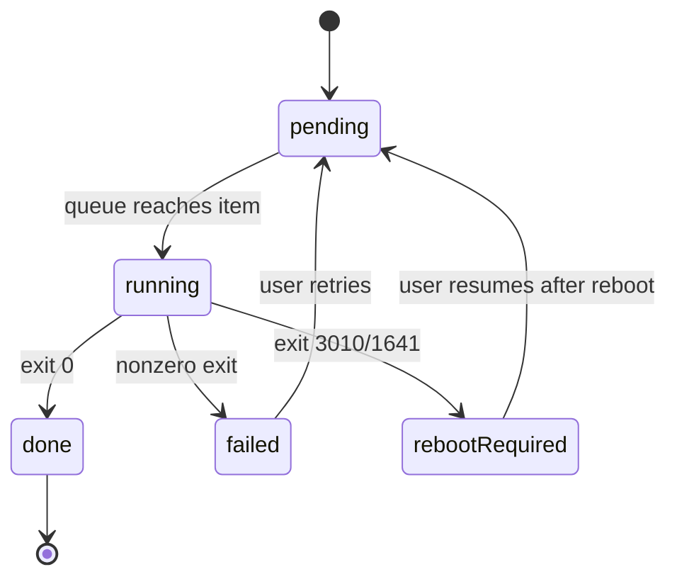

# App Flow

> Owner doc for FLOW-nn ids. Cites REQ-nn and SCR-nn. The app is tab-based
> (sidebar navigation in renderer.js), not routed; "route map" = tab map.

## Tab map

| Tab | SCR | Tier requirement |
|---|---|---|
| Applications (existing) | existing + SCR-04 queue panel | List: Audit; uninstall/queue: Full |
| Health Advisor (existing) | existing | Audit |
| Task Manager (new) | SCR-03 | List: Audit; kill/unlock: Full |
| System Clean (new) | SCR-05 | Scan: Audit; purge: Full |
| Quarantine (new) | SCR-02 | View: Audit; restore/delete: Full |
| (global) | SCR-01 banner | shown when Audit |

## Core journeys

- **FLOW-01** Startup elevation (REQ-04, REQ-05; SCR-01)
  1. App start -> main.js elevation check (WindowsPrincipal via engine).
  2. Elevated -> Full Mode, no banner. Done.
  3. Unelevated -> one-time dialog: "Restart as administrator?"
  - Branch: accept -> spawn elevated relaunch, current instance exits after
    child confirms start; spawn failure -> stay in Audit Mode + toast.
  - Branch: decline (incl. UAC cancel) -> Audit Mode, banner on, all
    destructive IPC rejected (NFR-02). Never exits or crashes (Rule 3).

- **FLOW-02** Purge with quarantine (REQ-01, REQ-02; SCR-06; replaces the
  direct-delete tail of the existing wizard)
  1. Existing wizard screens 1-5 unchanged (scan, review tree, Gate 2).
  2. Purge click -> engine: per item, files moved to vault + manifest row;
     registry keys exported to .reg then removed + manifest row.
  3. SCR-06 summary: quarantined counts, vault link, failures listed.
  - Branch: vault write fails for an item -> item untouched, reported
    failed (NFR-01).
  - Branch: file locked -> reported skipped with Unlock shortcut (FLOW-04)
    and, if ACL-denied, REQ-19 elevator offer.
  - Irreversible: nothing at this step -- reversal is FLOW-03. Vault
    "Delete Forever" is the only irreversible act, and it lives there.

- **FLOW-03** Quarantine restore / final delete (REQ-03; SCR-02)
  1. Quarantine tab -> select entry -> Restore -> files moved back, .reg
     imported -> entry marked restored.
  - Branch: destination exists -> per-item conflict prompt (keep both is
    not offered; skip or overwrite).
  - Branch: Delete Forever -> double-confirm -> permanent delete.
    Irreversible: yes, marked in UI.
  - Branch: auto-purge enabled -> entries older than retention days deleted
    at app start, logged (NFR-04).

- **FLOW-04** Unlock (REQ-07, REQ-08; SCR-03)
  1. Entry via Task Manager or FLOW-02 locked-item shortcut.
  2. Engine Restart Manager session lists holders.
  3. "Close gracefully" -> RmShutdown; recheck.
  - Branch: still locked -> per-process "Force end" (explicit second step);
    with REQ-08, suspend before close when the holder respawns.
  - Branch: zero holders -> "lock cleared or held by SYSTEM" message.

- **FLOW-05** Bulk uninstall (REQ-10, REQ-12, REQ-13; SCR-04)
  1. Multi-select apps -> queue panel -> Start (Full Mode only).
  2. Per app: restore point (frequency override REQ-13 around it) ->
     switch lookup (Rule 15 chain, method logged) -> run -> exit code.
  3. Queue state persisted after each app (NFR-05).
  - Branch: exit code = reboot required -> queue pauses (SCR-04 state).
  - Branch: non-silent uninstaller detected (interactive window) -> app
    marked "needs attention", queue continues.
  - Branch: msiserver disabled -> REQ-12 enables/starts, restores state
    after queue.

- **FLOW-06** System Clean audit-to-purge (REQ-11, REQ-14..17, REQ-19;
  SCR-05)
  1. Open cleaner section -> scan (Audit Mode allowed) -> review list.
  2. Check items -> Purge (Full Mode) -> quarantine pipeline (FLOW-02
     semantics per item type).
  - Branch: REQ-17 profile sweep -> hive load; any error -> finally-unload
    (NFR-07) + error state.
  - Branch: zero findings -> empty state, no purge button shown.

## State machines

Queue item (FLOW-05):

Vault entry (FLOW-02/03): quarantined -> restored (terminal) |
quarantined -> deleted (terminal, irreversible, double-confirmed).

## Session & data lifecycle

No login/session. Cached client-side: app inventory per session (existing
behavior). Vault manifest, settings, queue state, operation log persist on
disk (see 04-schema.md). Optimistic UI: never for destructive actions --
every purge/restore waits for engine confirmation.

## Decisions

- D-09: Elevated relaunch replaces the instance rather than running two.
  | Because: two instances writing one vault manifest invites corruption.
  | Rejected: side-by-side elevated child -- shared-state locking for a
  non-feature.

## Open questions

None.

## Gate checklist

- [x] Every SCR appears in at least one FLOW
- [x] Every FLOW cites REQ ids and only traverses existing SCR ids
- [x] Every branch has an outcome
- [x] Irreversible transitions are explicitly marked (Delete Forever only)
