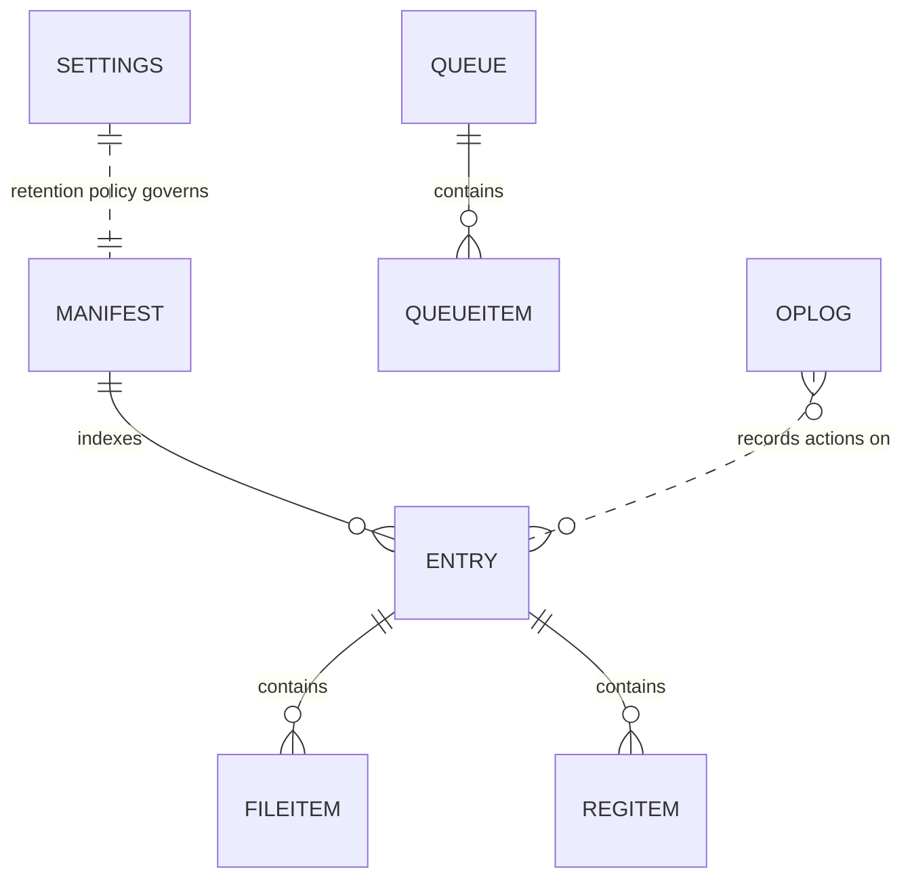

# Backend Schema -- the guardrail document

> Owner doc for ENT-nn ids. Cites REQ/FLOW ids. BINDING: implementation
> tasks that would violate the evolution rules must amend this doc first
> (new D-nn), then code. There is no database (TEC-05); entities are
> on-disk JSON files and directory layouts under the app data directory
> (Electron userData path). The template's SQL-specific rules are adapted
> below; the spirit (additive-only, zero-migration feature work) is
> unchanged.

## Evolution rules (binding, adapted for JSON-on-disk)

1. Additive-only: new keys and new files yes; renaming or removing existing
   keys no. Rename = add new key + write both + deprecate old (Deprecations
   table).
2. Every file carries a top-level `schemaVersion` (integer). Readers accept
   current and all older versions; writers write current. Unknown keys are
   preserved on rewrite, never stripped.
3. Missing keys always have a defined default in the reader. A new key must
   never make an old file unreadable.
4. IDs are UUIDv4 generated app-side (vault entries, queue items). Never
   array indexes or timestamps as identity.
5. Enum-like values are strings validated against a list in code, with
   unknown values treated as "other", never crashing the reader.
6. Every entity object reserves `meta: {}` for small non-queried additions;
   promotion to a first-class key happens at a milestone boundary with a
   D-nn.
7. One writer per file: only the main process (via engine results) writes;
   the renderer reads through IPC. Writes are atomic (temp file + rename).
8. The vault directory layout is append-only: entry folders are created and
   (on Delete Forever) removed whole; layout shape never changes within a
   release line.

## Entities

- **ENT-01** Vault manifest (`vault/manifest.json`) -- serves REQ-01,
  REQ-02, REQ-03, FLOW-02, FLOW-03
  | Field | Type | Default | Why |
  |---|---|---|---|
  | schemaVersion | int | 1 | rule 2 |
  | entries[] | array | [] | vault listing (SCR-02) |
  | entries[].id | UUID | -- | identity (rule 4) |
  | entries[].sourceApp | string | "unknown" | grouping in SCR-02 |
  | entries[].createdAt | ISO 8601 | -- | retention + display |
  | entries[].status | string | "quarantined" | quarantined/restored/deleted (rule 5) |
  | entries[].files[] | array | [] | original path -> vault relative path pairs + size + acl note (REQ-19) |
  | entries[].registry[] | array | [] | key path + .reg file name pairs |
  | entries[].meta | object | {} | rule 6 |

  Vault layout: `vault/<entry-id>/files/<n>/<leaf-name>` (indexed slots, see
  D-12) and `vault/<entry-id>/registry/<n>.reg`. Manifest is the index;
  folders are the payload. Each entry folder also holds an engine-written
  `entry.json` (D-13).

- **ENT-01b** Entry record (`vault/<entry-id>/entry.json`) -- serves REQ-01,
  NFR-01, NFR-04. Same shape as one `entries[]` row. Written by the engine
  (scanner.ps1) as the payload lands, so a purge interrupted between the
  move and the manifest write is still self-describing and recoverable.
  Single writer: the engine (rule 7 holds -- main.js never writes this file,
  the engine never writes `manifest.json`).

- **ENT-02** Settings (`settings.json`) -- serves REQ-03, FLOW-03
  | Field | Type | Default | Why |
  |---|---|---|---|
  | schemaVersion | int | 1 | rule 2 |
  | autoPurgeEnabled | bool | false | Rule 1/Rule 2: off by default |
  | autoPurgeRetentionDays | int | 30 | FLOW-03 auto-purge branch |
  | processRefreshSeconds | int | 2 | NFR-03 |
  | meta | object | {} | rule 6 |

- **ENT-03** Uninstall corrections (`corrections.json`, committed to repo,
  read-only at runtime) -- serves REQ-10, FLOW-05, Rule 15 chain step 1
  (PRIMARY source; winget dropped per OPEN-02, amended 2026-07-11)
  | Field | Type | Default | Why |
  |---|---|---|---|
  | schemaVersion | int | 1 | rule 2 |
  | apps[] | array | [] | per-app switch corrections |
  | apps[].match | object | -- | displayName/publisher matchers |
  | apps[].silentArgs | string | -- | verified switch string |
  | apps[].source | string | "community" | provenance note |
  | apps[].meta | object | {} | rule 6 |

- **ENT-04** Queue state (`queue.json`) -- serves REQ-10, FLOW-05, NFR-05
  | Field | Type | Default | Why |
  |---|---|---|---|
  | schemaVersion | int | 1 | rule 2 |
  | items[] | array | [] | one per queued app |
  | items[].id | UUID | -- | rule 4 |
  | items[].appKey | string | -- | registry key path of the app |
  | items[].state | string | "pending" | FLOW-05 state machine (rule 5) |
  | items[].method | string | null | winget/corrections/heuristic (Rule 15 logging) |
  | items[].exitCode | int | null | diagnosis |
  | items[].meta | object | {} | rule 6 |

- **ENT-05** Operation log (`oplog.jsonl`, append-only JSON lines) --
  serves NFR-04, all destructive FLOWs
  One object per line: `ts`, `action`, `tier`, `items` (count + summary),
  `outcome`, `meta`. Never rewritten, only appended; rotation at 5 MB by
  renaming with a date suffix.

## Relations diagram

## Access patterns

| FLOW | Reads | Writes |
|---|---|---|
| FLOW-02 purge | settings | manifest (append entry), vault folders, oplog |
| FLOW-03 restore/delete | manifest | manifest (status), vault folders, oplog |
| FLOW-03 auto-purge | settings, manifest | manifest, vault folders, oplog |
| FLOW-05 queue | corrections, queue | queue (per-app), oplog |
| FLOW-06 cleaners | -- | manifest + vault (via FLOW-02 pipeline), oplog |
| SCR-02 listing | manifest | -- |

All files are kilobyte-scale except vault payloads; no indexes needed;
manifest read is a single JSON parse per tab open.

## Deprecations

| Old | Replacement | Since | Remove at milestone |
|---|---|---|---|
| (none) | | | |

## Decisions

- D-10: One manifest.json index + per-entry folders, not per-entry
  manifests. | Because: SCR-02 listing needs one read; entry folders keep
  payloads isolated and Delete Forever is a folder remove. | Rejected:
  manifest per entry -- N file reads to list the vault.
- D-12: Vault file payloads live in indexed slots (`files/<n>/<leaf>`) with
  the original absolute path recorded in the manifest row, NOT a mirrored
  directory tree. | Because: mirroring `C:\Program Files\<publisher>\<app>\...`
  under `%APPDATA%\vanish\vault\<uuid>\files\` routinely exceeds the 260-char
  MAX_PATH that PowerShell 5.1 file APIs enforce, which would fail exactly the
  deep-nested leftovers the tool exists to remove. Restore is manifest-driven,
  so the mirror bought nothing but browsability. | Rejected: mirrored tree with
  `\\?\` long-path prefixes -- infects every path operation in the engine for
  cosmetic gain.
- D-13: The engine writes `entry.json` inside each entry folder; main.js
  writes `manifest.json`. | Because: NFR-01 requires no half-moved state, but
  the move happens in PowerShell and the manifest write in Node -- a crash
  between them would orphan a payload with no record of where it came from.
  A self-describing entry folder makes that recoverable. Rule 7 is preserved:
  one writer per file, not one writer per directory. | Rejected: manifest
  written by the engine -- two writers on the index file, the exact corruption
  rule 7 exists to prevent.
- D-11: oplog is JSONL, everything else is single-document JSON.
  | Because: the log is append-only and unbounded; documents are small and
  rewritten atomically. | Rejected: everything JSONL -- makes
  read-modify-write of settings awkward for no gain.

## Open questions

None.

## Gate checklist

- [x] Every ENT cites REQ/FLOW ids; every FLOW's data needs are covered
- [x] No entity exists that no REQ/FLOW touches
- [x] Every file satisfies the adapted rules 2-6
- [x] Access patterns cover every FLOW
- [x] Dry-run of next likely features (Stage 4 keyword purge, Stage 11 MSI
      quarantine, Stage 14 CleanerML): all reuse ENT-01 vault pipeline and
      ENT-05 log with zero schema changes -- new cleaners are new producers,
      not new formats. Definition packs (Rule 4) will be new read-only
      files, additive.
