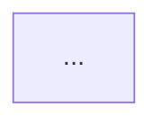

# Vanish: Promptgate

This document is a hard decision gate. Every feature plan, prompt, spec, implementation decision, and documentation change must be validated against these rules before any work begins. It is stateless — it does not depend on conversation history or context surviving a rotation. Run every decision through it fresh.

**If a proposed action violates any rule below, stop and resolve the violation first.**

---

## ARCHITECTURE

### Rule 1 — Discovery Depth and Deletion Policy are independent controls
Never couple how aggressively Vanish searches with how automatically it deletes. These are two separate axes:

- **Discovery Depth** (Safe / Moderate / Advanced): controls how far the search goes.
- **Deletion Policy** (Review before delete / Auto-purge confirmed orphans): controls what happens with findings.

A user must be able to run Advanced discovery and still review every finding before a single file is touched. Auto-purge is an opt-in setting, never a default. Any feature spec that conflates these two axes is rejected until they are separated.

---

### Rule 2 — Quarantine-first. Never direct deletion.
No destructive operation in Vanish deletes directly. Every removal follows this sequence:

1. Files: move to a versioned quarantine vault.
2. Registry entries: write to a restore manifest before removal.
3. Present findings to the user with quarantine details visible.
4. Quarantine auto-purge is user-controlled and off by default.

This applies without exception to: MSI caches, WMI entries, orphaned services, SharedDLLs, fonts, file associations, registry keys, and every other cleanup operation in every stage of the roadmap.

---

### Rule 3 — Elevation tiers: Audit Mode and Full Mode
Vanish operates in one of two capability tiers:

- **Audit Mode** (unelevated): Read-only. App listing, scan results, and report generation only. No destructive operations.
- **Full Mode** (elevated): All features available.

If UAC is declined, Vanish falls back to Audit Mode gracefully. It never silently exits or crashes on a declined elevation prompt. The UI must display a persistent banner in Audit Mode: *"Running in Audit Mode — elevate to enable cleaning and uninstallation."*

Any feature that assumes Full Mode without checking elevation state is rejected.

---

### Rule 4 — Zero bundled definition files
Vanish core ships with no BCU heuristic rules, no CleanerML definitions, no YARA rule files. These are downloaded separately as community definition packs at user request. The application binary and the definition packs are always architecturally separate. This maintains a clean GPL boundary and protects any future proprietary tier.

Any PR or implementation that bundles definition files into the application package is rejected.

---

### Rule 5 — YARA: engine only, user-supplied rules
Vanish ships the YARA binary for execution. It does not ship rule files. Users supply their own `.yar` files into a designated rules directory. Vanish provides the runner and directory watcher. This approach carries zero rule licensing liability.

Any plan to bundle YARA rule sets (including Elastic, community GitHub sets, or any other source) is rejected unless each rule file's license has been individually reviewed and cleared.

---

## THREAT INTELLIGENCE (PERMANENTLY CUT)

### Rule 6 — No cloud-based threat lookups. No submission features.
The following are permanently out of scope for Vanish:

- Cloud hash lookups against MalwareBazaar, VirusTotal, or any external threat database.
- Community Threat Submission wizards or pipelines.
- Any feature that sends file metadata, hashes, or paths to a third-party service.

**Rationale**: AV vendors own this space. Cloud lookups require user privacy consent infrastructure that is out of scope for this project. The submission pipeline creates legal and moderation liability. Users maintain their own AV solution. Vanish is not a replacement for it.

Do not re-add these features. If a future contributor proposes them, this rule is the rejection reason.

**Amendment, authorised by the operator 2026-08-13, SCOPED TO ONE SURFACE.**
Rule 6 has always been read as also forbidding a trusted-publisher allowlist,
on the grounds that Vanish does not get to vouch for software. That reading
still holds everywhere except one place.

The Health Advisor startup list (`tda`) may consult a publisher list **to
decide which of two visual groups an entry is drawn in, and for nothing
else.** It may never be consulted to permit, block, recommend or discourage a
removal, here or anywhere. `test/startup-groups-verify.js` asserts the list is
referenced only where it is defined and used; if that count changes, the
amendment has quietly widened and the change should be refused.

Why it was granted: an undifferentiated list of forty startup entries reads as
"all of this is suspicious", which is the opposite of what this app is for.

Two constraints came with it, and they are the interesting part:

1. **The grouping claim is about consequences, not quality.** "Necessary"
   means *do not touch this without knowing what you are doing*. The words
   "trusted" and "safe" are forbidden in this surface and asserted against,
   because both would be claims about the software rather than about what
   happens if you switch it off.
2. **The case that makes the distinction matter** is the operator's own:
   *"this is not useful in personal cases, but is necessary for
   corporate/enterprise machines where they install legalised spyware to
   monitor their employee's activities."* On a managed machine the monitoring
   agent belongs in the collapsed group **precisely because disabling it is a
   disciplinary event**, not because it is benign. A design that conflated
   those two would be lying to the person it is trying to help.

And the counterexample that keeps it honest: RealPlayer runs as LocalSystem
with auto-start and would score "necessary" on that signal alone -- while
being software the operator had just asked to get rid of, listening on every
interface (`ddx`). LocalSystem is therefore a **weak** signal in this
classifier and is never sufficient on its own. The first implementation hid
all three RealPlayer entries behind "your organisation put this here", via a
"the machine looks managed, and this is a machine-wide entry" proxy. That
proxy is gone: `managed` now requires the entry to sit under a Policies key,
which is evidence about *that entry* rather than about the machine.

Anything unclassifiable goes in the **visible** group with an explicit
"Vanish has no opinion" label. Hiding what it cannot explain is how a cleaner
ends up disabling something that mattered.

---

### Rule 7 — Behavioral heuristics: passive, local, display-only
The behavioral pattern detection that remains in scope is:

- Suspicious process tree flagging (e.g. Office apps spawning `cmd.exe` or `powershell.exe`).
- Destructive command detection (e.g. `vssadmin delete shadows`, host file edits).
- Persistence path display (Registry Run keys, Task Scheduler, AppInit_DLLs, Winlogon Shell).

All of these are **passive**, **local**, and **display-only**. Vanish shows the indicator. No automated action is taken. Findings are labelled: *"Indicator — investigate with your antivirus."*

This feature lives inside the Stage 3 Task Manager view. It is not a standalone threat engine.

---

## LANGUAGE & CLAIMS

### Rule 8 — "100% complete rollback" is banned language
Never use the phrase "100% complete rollback" in documentation, UI copy, marketing, or code comments.

The correct framing is: **"best-effort installation audit with quarantine-based reversion."**

Document explicitly wherever rollback is discussed: asynchronous installer side-effects, first-run service registrations, and reboot-deferred writes fall outside the snapshot window and cannot be reverted.

---

### Rule 9 — Performance figures are design targets until validated
All performance figures (startup time, scan throughput, memory footprint) are labelled as **"Design Targets"** in `docs/architecture.md` until validated.

Validated benchmarks go in `BENCHMARKS.md` with these test conditions documented per run:
- CPU model
- RAM (GB)
- Storage type (HDD / SATA SSD / NVMe)
- Number of installed applications
- Windows version and build
- Cold vs warm run

Never present unvalidated numbers as measured facts.

---

### Rule 10 — "Complete" means tested, not coded
A feature is only marked Complete in `CHANGELOG.md` when it has been manually
verified beyond "the local suite passes." Coded and passing local tests is
"In Progress."

**Amended 2026-08-12.** This rule originally required a clean Windows 10
(1607+) and Windows 11 VM pass, and pointed at `docs/handoff.md` — a file now
archived under `docs/history/`. Both parts are superseded:

- **The verification bar for 1.0** is Windows Sandbox plus real operator use.
  The clean-VM gate was waived by explicit decision (bd `0xt` closed), with
  the cost recorded in `docs/PRE-RELEASE.md` and stated publicly in README's
  Known limitations. The rule is not deleted — it is met by a *named, weaker
  standard whose weakness is written down*, which is the honest version of
  waiving it.
- **Status lives in bd and `CHANGELOG.md`**, never in a handoff file.

The part of this rule that has not changed and must not: passing `npm test` is
not evidence that a destructive path works. Anything that elevates, deletes,
or restores still needs a real run against a real machine before it is called
Complete.
A feature or stage is only marked Complete in `docs/handoff.md` or `CHANGELOG.md` when it has been manually verified on a clean Windows 10 VM (build 1607+) and a clean Windows 11 VM. Coded and passing local tests is "In Progress."

---

## LICENSING

### Rule 11 — Check the license before touching any FOSS tool
Before referencing, borrowing concepts from, or structuring output similar to any FOSS project, verify its license. The minimum check:

| License | What it means for Vanish |
|---------|--------------------------|
| MIT | Can use freely, including in proprietary tier |
| BSD 2/3-Clause | Can use freely, including in proprietary tier |
| GPLv3 | Core code and rule sets cannot be bundled in a proprietary tier. Use the definitions loader model (Rule 4). |
| Elastic License 2.0 | Cannot be used in any commercial product. Full stop. |
| Freeware (closed source) | Study and reference only. No code reuse. |

Current reference tool licenses:

| Tool | License |
|------|---------|
| BCUninstaller | GPLv3 |
| System Informer | MIT |
| TaskExplorer | GPLv3 |
| OpenArk | GPLv3 |
| PE-sieve / HollowsHunter | BSD 2-Clause |
| BleachBit / CleanerML | GPLv3 |
| winget-cli | MIT |
| Display Driver Uninstaller | Freeware (closed source) |
| Microsoft PowerToys | MIT |
| YARA engine | BSD 3-Clause |

If a tool is not on this list, look it up before using it. Add it to `research.md` with its license field.

---

### Rule 12 — Dual-licensing requires legal review before implementation
If a proprietary Pro tier is ever pursued, get a legal review of the GPL boundary before writing a single line of Pro-specific code. The definitions loader architecture (Rule 4) is the primary boundary mechanism. Do not assume the separation is clean without professional review.

---

## ELEVATION & SECURITY

### Rule 13 — Use WindowsPrincipal for elevation checks. Not `net session`.
All elevation state detection uses:
```powershell
[Security.Principal.WindowsPrincipal]::new(
    [Security.Principal.WindowsIdentity]::GetCurrent()
).IsInRole([Security.Principal.WindowsBuiltInRole]::Administrator)
```

`net session` is banned for this purpose. It parses error output and produces false positives in enterprise environments with restricted net commands.

This applies to the implementation code and all documentation references.

---

### Rule 14 — Code signing is a hard release gate
Unsigned builds are for local development only. No unsigned binary is distributed externally under any circumstances, including pre-release and beta builds.

Distribution requirements:
- EV or OV code signing certificate.
- All distributed binaries signed before packaging.
- SmartScreen reputation impact acknowledged (OV certificates require a reputation build-up period before warnings disappear).

The full release checklist lives in `RELEASING.md`.

---

## WINGET & UNINSTALLER ARGUMENTS

### Rule 15 -- corrections JSON is the source of truth for uninstaller switches
The uninstaller argument lookup chain is:

1. Project-maintained corrections JSON (stored in repo, community-correctable)
2. Heuristic fallback sequence: `/qn` -> `/S` -> `--silent` -> `-quiet`

Log which method succeeded per app to improve the corrections database over time.

**winget dropped as a runtime source (amended 2026-07-11, supersedes the prior 3-step chain).** Research OPEN-02 (Antigravity, bd `vanish-uninstaller-1gi`) confirmed: winget's default source is now a REST API (`cdn.winget.microsoft.com/cache`), so `winget show`/`search` trigger a network call -- which Rule 6 permanently forbids -- and there is no full offline manifest cache. `winget show`/`export` do not even emit the `UninstallerSwitches` field. Rule 6 wins the conflict, so winget cannot be a runtime lookup step. If a bundled offline manifest snapshot is ever pursued, it must come in as a user-requested definition pack under Rule 4, never a network fetch, and would be a Standard-tier addition -- not part of this chain.

---

## ROADMAP EXECUTION

### Rule 16 — Respect stage priority tiers. No skipping ahead.

| Tier | Stages | Condition |
|------|--------|-----------|
| **Core** | 1, 2, 3, 6, 9 | Must complete before any public release |
| **Standard** | 4, 7, 8, 11, 12, 14 | Ships in v1.x post-launch |
| **Extended** | 10, 13 | Future milestones, no committed timeline |

Do not begin Standard work until all Core stages are complete and tested per Rule 10. Do not commit Extended stages to any public timeline.

---

### Rule 17 — Stage 10 (DCOM/WMI Cleanup) requires mandatory UI review gate
Auto-deletion of WMI entries is permanently disabled by default. The Stage 10 implementation must:

1. Display an expandable list of every found entry with full path and description.
2. Require individual checkbox selection before any action is taken.
3. Generate a quarantine manifest before removal (per Rule 2).
4. Never offer a "delete all" button without individual review first.

This rule exists because WMI namespace corruption is difficult to diagnose and repair. The risk of a false positive deletion breaking an unrelated service is too high to allow auto-deletion.

---

## DOCUMENTATION

### Rule 18 — No local filesystem paths in any doc file
Local paths (e.g. `d:\path\to\vanish`) expose developer environment structure in a public repository and become stale immediately for contributors. Use the canonical GitHub URL for repository references.

---

### Rule 19 — status lives in bd, not in a handoff file
**Rewritten 2026-08-12.** This rule used to require the newest
`docs/HANDOFF-YYYY-MM-DD.md` to carry per-file status indicators. That
practice produced five files that each said "start here", and a session
resuming work had to determine which future it was living in before it could
do anything. All five are archived under `docs/history/` and are explicitly
not to-do lists.

Replaces it:
- **Work status** is `bd` — `bd list --status=open`, `bd show <id>`. One issue
  per unit of work, closed with the verification detail in the close reason.
- **Scope** is `docs/PRE-RELEASE.md`, the single source of truth for what is
  in, what is cut, and why.
- **What shipped** is `CHANGELOG.md`.
- **What the code is** is `ARCHITECTURE.md` (as-built).

Do not create a new handoff file. If a narrative record of a session is
genuinely warranted, it goes in `docs/history/` with a row added to that
folder's README, and it still does not carry status — bd does.
- `*(Status: Stub)*`

Without status indicators an LLM resuming work has no signal about what is implemented vs placeholder.

---

### Rule 20 — the current dated handoff must reference `docs/roadmap.md` for Stages 6+
The Core-tier checklist in the newest `docs/HANDOFF-YYYY-MM-DD.md` must say explicitly that it covers Core tier stages only, and must direct any resuming agent to `docs/roadmap.md` for the full plan.

---

### Rule 21 — All Mermaid blocks require the `mermaid` language tag
````

````
Untagged blocks render as plaintext on GitHub. Any diagram block without the tag is broken until fixed.

---

### Rule 22 — README.md must exist before any public sharing
A `README.md` at the repo root is required before any public announcement, social post, or link-sharing. Minimum content: project description, screenshot or UI preview, tech stack, elevated build/run instructions, links to docs. No README means no public sharing, full stop.

---

### Rule 23 — "JavaScript" is always uppercased. "XML" is always uppercased.
These are proper nouns and acronyms respectively. "Javascript" and "xml" in any doc file are typos.

---

## STATUS COMMUNICATION

### Rule 24 — Ambiguous status must be classified before display
Never surface a raw Windows status enum (PnP `Unknown`, driver state codes, service state codes, scan result codes) directly to the user. Classify it into a plain-language category with a benign/needs-review signal before it reaches any UI or report. A bare ambiguous status reads as alarming regardless of actual severity, and classification is a research step the app is already positioned to do -- deferring it to the user, or to an external tool, is a completed feature shipped as an unfinished one.

This rule exists because a raw "Unknown" status covers wildly different real conditions (a benign ghost VSS snapshot record and a genuinely failed device look identical unclassified) -- the fix is one extra classification pass, not new capability, so there's no excuse for skipping it.

---

## HOW TO USE THIS FILE

When starting any planning, speccing, prompting, or implementation session for Vanish:

1. State the proposed action.
2. Walk through the rules above that are relevant to it.
3. If any rule is violated, resolve the violation before proceeding.
4. If the action passes all relevant rules, proceed.

This file takes precedence over all other Vanish documentation in the event of a conflict. If this file and another doc disagree, update the other doc to match this file.
