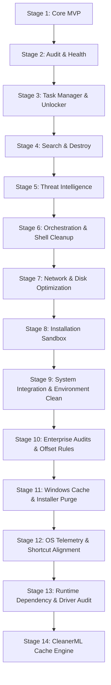

# Vanish: Roadmap & Future Development Plan

This document details the multi-stage roadmap for Vanish, outlining upcoming milestones, technical implementations, and research paths.

---

## 🗺️ Development Phases

### Stage 1: Core MVP (Current Status)
* **Status**: Completed.
* **Deliverables**: Registry & UWP package mapping, System Restore Point triggers, Safe/Moderate/Advanced scanning heuristics, and remnant deletion.

### Stage 2: Audit & Health Advisor UI
* **Goal**: Provide a detailed overview of the system's software health and resource utilization.
* **Technical Tasks**:
  * **Asynchronous Sizing Worker**: Run a background thread to calculate physical folder sizes and cache them to disk.
  * **Boot Speed Analyzer**: Inspect registry `Run` hives (`HKCU/HKLM\Software\Microsoft\Windows\CurrentVersion\Run`), Task Scheduler (`Get-ScheduledTask`), and active Services to identify applications running on startup and calculate their startup latency impact.
  * **Consolidation Engine**: Detect redundant software (e.g. multiple web browsers, matching PDF readers) and alert the user.
  * **Optimized Diagnostics Query**: Query hardware and system diagnostics using specific CIM SELECT filters (e.g., `Get-CimInstance -Query "SELECT Name, Caption FROM Win32_ComputerSystem"`), falling back to fast registry cache lookups to prevent thread delays.

### Stage 3: Task Manager & "Unlocker" Integration
* **Goal**: Enable process management, resource tracking, and file/folder handle releasing (the "Unlocker" feature).
* **Technical Tasks**:
  * **Process Monitor**: A real-time process manager detailing CPU, Memory, Disk, and Network utilization.
  * **Native Handle Locking Resolver (Unlocker)**:
    * *Implementation*: We will invoke the native **Windows Restart Manager API** (`rstrtmgr.dll`) via inline C# compile inside PowerShell (`Add-Type`).
    * *API Sequence*:
      1. `RmStartSession`: Start a Restart Manager session.
      2. `RmRegisterResources`: Register the target locked file or folder path.
      3. `RmGetList`: Query all processes (Process IDs and Names) currently holding locks on the registered resource.
      4. `RmShutdown`: Trigger a clean shutdown request to those processes, falling back to forceful process termination (`Stop-Process -Id <PID> -Force`) if they fail to close.
    * *Benefit*: 100% native, requires no external executables, and handles locks safely.
  * **Watchdog Suspension System**: Integrate process suspension (using native `NtSuspendProcess` bindings) before closing handles, ensuring watchdog processes do not spawn new locking threads during remnant cleanup.

### Stage 4: Search & Destroy Keyword Purge
* **Goal**: Allow users to enter arbitrary app names or folders to run a deep-scan cleanup, even if the application does not have a registry uninstaller entry.
* **Technical Tasks**:
  * Input a custom application keyword (e.g., "Slack") and a publisher keyword (e.g., "Slack Technologies").
  * Run the `Scan-Leftovers` engine with the keywords, displaying files/registry keys found in common system paths.
  * Safely purge the elements upon approval.

### Stage 5: Threat Intelligence Hunting Model
* **Goal**: Identify and mitigate destructive, malicious, or highly suspicious application behaviors.
* **Technical Tasks**:
  * **Signature-Based Hunting**: Run MD5/SHA256 hashing on startup executables and check them against local rule definitions or external Threat Intelligence APIs.
  * **Behavioral Heuristics (Process Spawning)**:
    * Detect suspicious process trees (e.g., Microsoft Word spawning `powershell.exe` or `cmd.exe`).
    * Flag active programs executing destructive commands, such as attempts to delete volume shadow copies (`vssadmin delete shadows`) or edit host DNS files.
  * **Persistence Scan**: Check common malware persistence paths (e.g., Winlogon Shell modifications, AppInit_DLLs, browser helper objects).
  * **Integration with YARA**: Run lightweight YARA file pattern scans on suspicious directories.

### Stage 6: Orchestration & Shell Cleanup
* **Goal**: Enable bulk uninstallation and clean left-behind Windows shell context menus.
* **Technical Tasks**:
  * **Bulk Silent Uninstaller**: Group multiple uninstallation requests and run them sequentially (using native switches like `/qn` or `/S`) while trapping exit codes to block on reboot requirements.
  * **Context Menu Cleaner**: Scan registry keys (under `HKCR\*\shellex\ContextMenuHandlers` and related classes) for orphaned CLSID associations linked to removed executables and clean them up.
  * **Installer Lockout Manager**: Validate and configure the `msiserver` (Windows Installer) service state before executing uninstallation queues, temporarily enabling and starting it if needed, and managing concurrent locks.
  * **Restore Point Frequency Override**: Temporarily set the `SystemRestorePointCreationFrequency` registry registry value to `0` prior to calling system checkpoint commands, restoring it immediately afterward to ensure restore points are generated successfully on consecutive uninstalls.

### Stage 7: Network & Disk Optimization
* **Goal**: Provide active network monitoring, firewall control, and temporary junk file cleaning.
* **Technical Tasks**:
  * **Network Inspector**: List active sockets per application and resolve destination IP addresses.
  * **Firewall Controller**: Enable one-click firewall blocking rules via PowerShell (`New-NetFirewallRule`) to cut off internet access for suspicious programs.
  * **Junk Sweeper**: Scan and delete cache repositories, temp files, crash dumps, and leftover Windows Update downloads.

### Stage 8: Installation Sandbox Rollback (The Complete End-to-End)
* **Goal**: Allow users to monitor installer executions in real-time to enable 100% complete rollbacks.
* **Technical Tasks**:
  * **Snapshot Scanner**: Capture system folder and registry states immediately before and after running a custom installer, tracking diff logs.
  * **Installation Logger**: Generate an isolated log file detailing every registry write, file addition, and driver registration performed by the program installer.
  * **Total Rollback Purge**: Offer a one-click rollback that reverts every change logged, ensuring zero leftover traces.

### Stage 9: System Integration & Environment Clean
* **Goal**: Purge orphaned system services, driver repositories, path variables, and file associations.
* **Technical Tasks**:
  * **Services & Drivers Purge**: Query registry service trees and remove leftover entries using `Remove-Service` or `sc.exe delete`, clean third-party driver store files via `pnputil /delete-driver`.
  * **PATH Environment Cleaner**: Scan user and system scope `PATH` environment variables using the `[System.Environment]` API, executing `Test-Path` check passes to filter out dead directories and remove redundant values.
  * **File Association & Protocol Repair**: Scan `Explorer\FileExts` registry hives, identifying broken CLSID handlers pointing to deleted executables, and purge dead file/protocol links.
  * **NTFS/ACL Ownership Elevators**: Implement native `takeown.exe` or ACL modification scripts to bypass folder access restrictions when deleting leftover files in system-locked paths.
  * **Multi-User Profile Registry Sweep**: Implement offline registry hive loading (`reg.exe load`) for `NTUSER.DAT` files of inactive users to sweep remnants from all user profiles, unloading them safely post-cleanup.
  * **Auto-UAC Relauncher**: Implement startup elevation check in the Electron main process, auto-spawning elevated child processes via `Start-Process -Verb RunAs` if executed without admin rights.
  * **Explicit Registry Redirection Bypass**: Use `OpenBaseKey` API with explicit `RegistryView.Registry64` and `RegistryView.Registry32` configurations in the PowerShell scanner to avoid automatic registry redirection issues when inspecting Wow6432Node keys.

### Stage 10: Enterprise Audits & Offset Rules
* **Goal**: Scrub advanced enterprise database relics and incorporate community mapping offsets.
* **Technical Tasks**:
  * **DCOM & WMI Namespace Cleanup**: Scan for orphaned WMI classes and DCOM app registrations referencing missing executables, cleaning the keys to prevent event log error noise.
  * **Event Log Channel Cleaner**: Clean orphaned application log channels registered under `EventLog` keys.
  * **Crowdsourced Offsets Database**: Load a community-driven JSON heuristics rules database to automatically map atypical directories that do not match application names (such as hidden `.config`, `.toolcache`, or `.unity3d` folders).

### Stage 11: Windows Cache & Installer Purge
* **Goal**: Safely clean orphaned system installer caches and SharedDLL registry value counters.
* **Technical Tasks**:
  * **Orphaned MSI/MSP Sweeper & Quarantine**: Scan `C:\Windows\Installer` for `.msi` and `.msp` local package files, cross-referencing them against active registry packages in `HKLM\Software\Microsoft\Windows\CurrentVersion\Installer\LocalPackages` to identify unreferenced installers. Move them to a secure quarantine directory vault instead of straight deletion to prevent registry/installer corruption.
  * **SharedDLLs Reference Cleaner**: Inspect paths registered under `HKLM\SOFTWARE\Microsoft\Windows\CurrentVersion\SharedDLLs`. For any path where a `Test-Path` check fails (the DLL is physically gone), remove the registry count value to clean up dead links.

### Stage 12: OS Telemetry & Shortcut Alignment
* **Goal**: Scrub Jump Lists, AppCompat telemetry caches, Prefetch logs, and orphaned fonts.
* **Technical Tasks**:
  * **Jump Lists & Pin Scrub**: Locate pinning shortcuts and recent Jump List shortcut hashes (`.lnk` files) under `AppData\Roaming\Microsoft\Windows\Recent\AutomaticDestinations`, deleting dead links pointing to missing application executables.
  * **AppCompat Assistant Cleaner**: Scan registry keys under AppCompat Assistant stores (`AppCompatFlags\Compatibility Assistant\Store`) and delete telemetry values matching uninstalled executable names.
  * **Prefetch Cache Cleaner**: Scan the `C:\Windows\Prefetch` directory, locate and delete `.pf` execution cache files matching the uninstalled app's executable names to clean OS execution history.
  * **Orphaned Fonts Cleaner**: Match font registries under `Windows NT\CurrentVersion\Fonts` against files in `C:\Windows\Fonts`, removing registry maps for missing fonts.

### Stage 13: Runtime Dependency & Driver Audit
* **Goal**: Audit dynamic linking dependencies to identify unused runtime packages (e.g. older Visual C++ redistributables) and idle hardware/developer drivers (e.g. Google USB drivers).
* **Technical Tasks**:
  * **PE Import Scanner**: Write a quick PE (Portable Executable) binary parser in PowerShell/C# that reads the import directory headers of installed application main executables, matching runtime references (e.g. `msvcr100.dll` imports) to map a database of active Visual C++ version dependencies.
  * **Orphaned Runtime Detector**: Cross-reference the active dependency map against installed runtime packages. Flag any installed runtimes (e.g. Visual C++ 2005 or 2010) that have no active application references, warning that they can be uninstalled safely to reduce clutter and can be easily fetched again when required.
  * **Idle Driver Auditor**: Cross-reference active hardware classes (`Get-PnpDevice -Status OK`) against third-party OEM drivers (`Get-WindowsDriver`), flagging installed developer or debug drivers (such as the Google USB debugging driver or Samsung Android driver) that are currently idle (no connected physical devices).

### Stage 14: CleanerML Cache Engine
* **Goal**: Provide an unpretentious, highly effective, transparent junk file cleaning service utilizing crowdsourced XML cleaning rules.
* **Technical Tasks**:
  * **CleanerML Engine**: Build a lightweight XML parser in Node.js to consume standard open-source **CleanerML** (BleachBit markup standard) definition files.
  * **Folder/Registry Cleaner**: Execute CleanerML instructions (glob directory deletions, registry key wipes, MRU clearing) safely on the system.
  * **Audit Report Details**: Display exact file paths, file sizes, and deleted counts in a transparent report, avoiding vague marketing optimization claims.

---

## ⚖️ Open Source & License Assessment

### 1. Monetization Strategy vs. FOSS Analysis
* **Security & Administrative Trust**: Uninstallation utilities require highest administrative permissions (`requireAdministrator` privileges) to operate. Users are naturally cautious of closed-source applications requiring root access. Keeping the codebase open-source ensures **full code transparency**, proving to developers and security professionals that the app contains no hidden telemetry, ads, or backdoors.
* **Proposed Monetization Models**:
  1. **Microsoft Store Paid "Convenience Edition" (Recommended)**: Keep the raw source code 100% open-source and free on GitHub (compilable by developers), but charge a small, one-time convenience fee ($4.99–$9.99) on the Microsoft Store. This model (proven by NanaZip, ShareX, and Greenshot) is highly popular as users happily pay for automated background updates and single-click store deployment, while Microsoft handles payment processing completely.
  2. **Open-Core / Dual-Licensing**: Distribute the core Uninstaller, System Diagnostics, and Cleaner modules under an open-source license (e.g., GPLv3). Bundle the advanced real-time process heuristic scanning, automated sandbox installation tracking, and corporate fleet auditing tools as a paid, proprietary "Pro" edition.
  3. **Personal Free / Commercial Paid**: Distribute the full app for free to individual home users, but require corporate licenses for system administrators deploying the tool across enterprise workstations.
* **Community-Driven Heuristics**: Software developers change installation structures constantly. An open-source model allows the community to contribute new scanning rules and file lock workarounds.
* **Premium UX Competitiveness**: The existing FOSS options are visually outdated. A sleek, modern glassmorphic application will quickly capture developer attention.

### 2. Can We Use Existing FOSS Solutions to Accelerate Development?
Yes. We should review and leverage these notable open-source projects:
* **BCUninstaller (Bulk Clog Uninstaller)**:
  * *What it is*: A feature-rich .NET application for bulk software uninstallation.
  * *How to use it*: BCUninstaller has a highly mature registry heuristic engine. We can reference its matching rules for publisher/app clustering to refine our Moderate and Advanced scan modes.
* **System Informer (formerly Process Hacker)**:
  * *What it is*: A powerful open-source process manager and handle inspector.
  * *How to use it*: We can study its C-based native handle querying logic to optimize our "Unlocker" C# implementation.
* **YARA (VirusTotal)**:
  * *What it is*: A pattern-matching Swiss Army knife for security researchers.
  * *How to use it*: We can include the YARA DLL or node bindings to scan executable files against standard security rule files locally.
* **Display Driver Uninstaller (DDU)**:
  * *What it is*: The industry-standard GPU/audio driver uninstaller by Wagnard.
  * *How to use it*: We can inspect its C# routines for driver store cleaning and Safe Mode restarts to implement driver-level cleanups.
* **Microsoft PowerToys (File Locksmith)**:
  * *What it is*: A native utility for auditing and unlocking file/folder handles.
  * *How to use it*: We can study its C++ source code to optimize our native Windows Restart Manager handle mappings.
* **BleachBit CleanerML**:
  * *What it is*: An XML-based markup standard defining clean-up paths for hundreds of apps.
  * *How to use it*: We can import and parse CleanerML definitions in Node.js to instantly clean junk files for hundreds of third-party programs.
* **winget-cli (Windows Package Manager)**:
  * *What it is*: Microsoft's official CLI package manager.
  * *How to use it*: We can query the winget open-source manifest database to retrieve silent installation/uninstallation arguments and switches.
