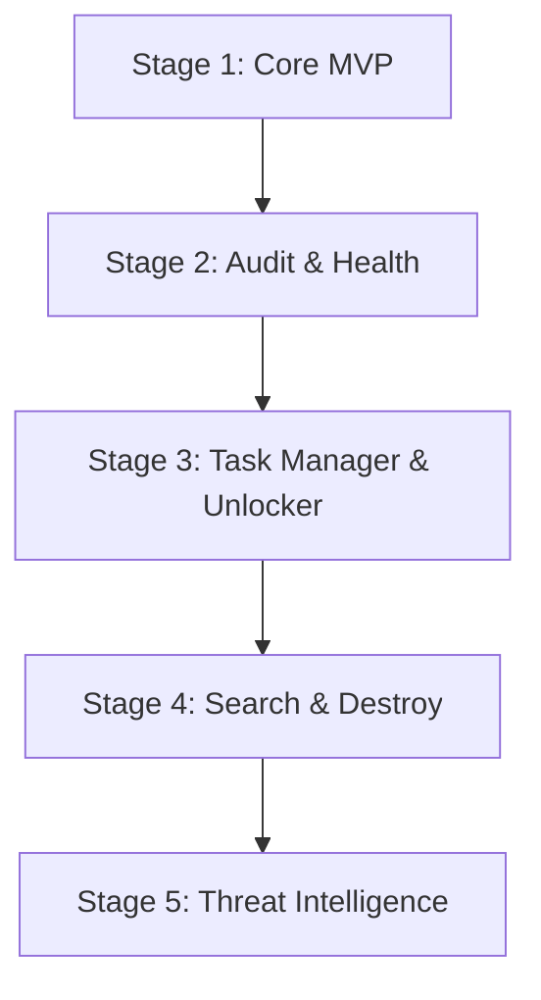

# Vanish: Roadmap & Future Development Plan

This document details the multi-stage roadmap for Vanish, outlining upcoming milestones, technical implementations, and research paths.

---

## 🗺️ Development Phases

### Stage 1: Core MVP (Current Status)
* **Status**: Completed.
* **Deliverables**: Registry & UWP package mapping, System Restore Point triggers, Safe/Moderate/Advanced scanning heuristics, and remnant deletion.

### Stage 2: Audit & Health Advisor UI
* **Goal**: Provide a detailed overview of the system's software health and resource utilization.
* **Technical Tasks**:
  * **Asynchronous Sizing Worker**: Run a background thread to calculate physical folder sizes and cache them to disk.
  * **Boot Speed Analyzer**: Inspect registry `Run` hives (`HKCU/HKLM\Software\Microsoft\Windows\CurrentVersion\Run`), Task Scheduler (`Get-ScheduledTask`), and active Services to identify applications running on startup and calculate their startup latency impact.
  * **Consolidation Engine**: Detect redundant software (e.g. multiple web browsers, matching PDF readers) and alert the user.

### Stage 3: Task Manager & "Unlocker" Integration
* **Goal**: Enable process management, resource tracking, and file/folder handle releasing (the "Unlocker" feature).
* **Technical Tasks**:
  * **Process Monitor**: A real-time process manager detailing CPU, Memory, Disk, and Network utilization.
  * **Native Handle Locking Resolver (Unlocker)**:
    * *Implementation*: We will invoke the native **Windows Restart Manager API** (`rstrtmgr.dll`) via inline C# compile inside PowerShell (`Add-Type`).
    * *API Sequence*:
      1. `RmStartSession`: Start a Restart Manager session.
      2. `RmRegisterResources`: Register the target locked file or folder path.
      3. `RmGetList`: Query all processes (Process IDs and Names) currently holding locks on the registered resource.
      4. `RmShutdown`: Trigger a clean shutdown request to those processes, falling back to forceful process termination (`Stop-Process -Id <PID> -Force`) if they fail to close.
    * *Benefit*: 100% native, requires no external executables, and handles locks safely.

### Stage 4: Search & Destroy Keyword Purge
* **Goal**: Allow users to enter arbitrary app names or folders to run a deep-scan cleanup, even if the application does not have a registry uninstaller entry.
* **Technical Tasks**:
  * Input a custom application keyword (e.g., "Slack") and a publisher keyword (e.g., "Slack Technologies").
  * Run the `Scan-Leftovers` engine with the keywords, displaying files/registry keys found in common system paths.
  * Safely purge the elements upon approval.

### Stage 5: Threat Intelligence Hunting Model
* **Goal**: Identify and mitigate destructive, malicious, or highly suspicious application behaviors.
* **Technical Tasks**:
  * **Signature-Based Hunting**: Run MD5/SHA256 hashing on startup executables and check them against local rule definitions or external Threat Intelligence APIs.
  * **Behavioral Heuristics (Process Spawning)**:
    * Detect suspicious process trees (e.g., Microsoft Word spawning `powershell.exe` or `cmd.exe`).
    * Flag active programs executing destructive commands, such as attempts to delete volume shadow copies (`vssadmin delete shadows`) or edit host DNS files.
  * **Persistence Scan**: Check common malware persistence paths (e.g., Winlogon Shell modifications, AppInit_DLLs, browser helper objects).
  * **Integration with YARA**: Run lightweight YARA file pattern scans on suspicious directories.

---

## ⚖️ Open Source & License Assessment

### 1. Is Open Source & Free a Good Idea?
**Yes, absolutely.**
* **Security & Administrative Trust**: Uninstallation utilities require highest administrative permissions (`requireAdministrator` privileges) to operate. Users are naturally cautious of closed-source applications requiring root access. Making Vanish open-source ensures **full code transparency**, proving to developers and security professionals that the app contains no hidden telemetry, ads, or backdoors.
* **Community-Driven Heuristics**: Software developers change installation structures constantly. An open-source model allows the community to contribute new scanning rules and file lock workarounds.
* **Premium UX Competitiveness**: The existing FOSS options are visually outdated. A sleek, modern glassmorphic application will quickly capture developer attention.

### 2. Can We Use Existing FOSS Solutions to Accelerate Development?
Yes. We should review and leverage these notable open-source projects:
* **BCUninstaller (Bulk Clog Uninstaller)**:
  * *What it is*: A feature-rich .NET application for bulk software uninstallation.
  * *How to use it*: BCUninstaller has a highly mature registry heuristic engine. We can reference its matching rules for publisher/app clustering to refine our Moderate and Advanced scan modes.
* **System Informer (formerly Process Hacker)**:
  * *What it is*: A powerful open-source process manager and handle inspector.
  * *How to use it*: We can study its C-based native handle querying logic to optimize our "Unlocker" C# implementation.
* **YARA (VirusTotal)**:
  * *What it is*: A pattern-matching Swiss Army knife for security researchers.
  * *How to use it*: We can include the YARA DLL or node bindings to scan executable files against standard security rule files locally.
