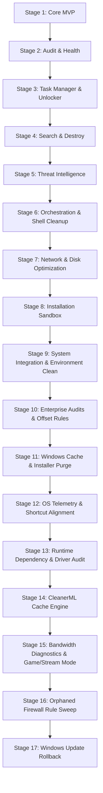

# Vanish: Roadmap & Future Development Plan

This document details the multi-stage roadmap for Vanish, outlining upcoming milestones, technical implementations, and research paths.

---

## 🗺️ Development Phases

```mermaid
graph TD
    P1[Stage 1: Core MVP] --> P2[Stage 2: Audit & Health]
    P2 --> P3[Stage 3: Task Manager & Unlocker]
    P3 --> P4[Stage 4: Search & Destroy]
    P4 --> P5[Stage 5: Threat Intelligence]
    P5 --> P6[Stage 6: Orchestration & Shell Cleanup]
    P6 --> P7[Stage 7: Network & Disk Optimization]
    P7 --> P8[Stage 8: Installation Sandbox]
    P8 --> P9[Stage 9: System Integration & Environment Clean]
    P9 --> P10[Stage 10: Enterprise Audits & Offset Rules]
    P10 --> P11[Stage 11: Windows Cache & Installer Purge]
    P11 --> P12[Stage 12: OS Telemetry & Shortcut Alignment]
    P12 --> P13[Stage 13: Runtime Dependency & Driver Audit]
    P13 --> P14[Stage 14: CleanerML Cache Engine]
    P14 --> P15[Stage 15: Bandwidth Diagnostics & Game/Stream Mode]
    P15 --> P16[Stage 16: Orphaned Firewall Rule Sweep]
    P16 --> P17[Stage 17: Windows Update Rollback]
```

## Stage Priority Tiers

| Tier | Stages | Condition |
|------|--------|-----------|
| **Core** | 1, 3, 6, 9 | Must complete before any public release |
| **Standard** | 4, 8 (reduced), 11, 13 (info-only slice), 14, 15, 16, 17 | Ships in v1.x post-launch |
| **Extended** | 10 | Future milestone, no committed timeline, waits on 17 (VM pass) |
| **Dissolved** | 2, 7, 12 | Re-scoped 2026-08-05 into Core stages / Stage 14 rather than shipped standalone; see each stage below |

Do not begin Standard work until all Core stages are complete and tested on clean Windows 10 and Windows 11 VMs. Do not commit Extended stages to any public timeline. See `docs/promptgate.md` Rule 16.

Note: earlier revisions of this table listed Stage 2 under Core, but the
locked implementation plan (`docs/planning/05-implementation-plan.md`,
derived from the viability gate on `vanish-uninstaller-22n`) never scoped a
TASK for it -- Core in practice has always meant Stages 1/3/6/9. Fixed here
to match reality rather than carry a stale entry.

### 2026-08-05 re-scope pass

Six Standard/Extended stages (2, 4, 7, 8, 12, 13) got re-evaluated against
real measurements taken on the operator's own machine, the same way Stage
11's driver-store numbers justified that stage originally -- rather than
carrying speculative scope indefinitely. Each stage below records what was
measured and the resulting decision: kept as scoped, reduced and folded into
an existing screen, or dissolved into Stage 14's tiered cleaning engine.
Guiding rule applied throughout: prefer a small stat/badge on a screen Core
already ships over a new dedicated wizard -- real technical depth, without
new tiresome UX.

### Stage 1: Core MVP (Current Status)
* **Status**: Completed.
* **Deliverables**: Registry & UWP package mapping, System Restore Point triggers, Safe/Moderate/Advanced scanning heuristics, and remnant deletion.

### Stage 2: Audit & Health Advisor UI *(Dissolved 2026-08-05 -- folded into Stage 3's Task Manager tab and the existing app list, no standalone screen)*
* **Goal**: Provide a detailed overview of the system's software health and resource utilization.
* **Re-scope rationale, measured on the operator's own machine 2026-08-05**:
  the "real, named pain point" bar the original Boot Speed Analyzer note set
  for itself turned out to be met -- 38 non-Microsoft-attributed scheduled
  tasks and 25 non-Microsoft auto-start services, several visibly stale
  (RealPlayer alone: 2 services + 2 scheduled tasks; a CCleaner "Skip UAC"
  task; Zoom and a Comet-branded updater task). That's real signal. The
  Consolidation Engine side found almost nothing to consolidate (Brave +
  Edge only; zero duplicate PDF readers or archivers) -- a dedicated screen
  for that would sit empty most of the time. Net result: the startup-impact
  half earns a place, the consolidation half doesn't earn its own UI.
* **Technical Tasks (revised)**:
  * **Startup impact, folded into Stage 3's Task Manager tab**: list
    Scheduled-Task and Service-based auto-starts -- the two categories
    Windows' own Task Manager Startup tab does not cover -- as extra rows
    in the existing process/startup view. Still detection-only, same as
    originally scoped; no enable/disable toggles (Rule: don't rebuild what
    Task Manager already does).
  * **Consolidation hint, folded into the existing app list**: a single
    inline badge on an app row ("Also installed: Microsoft Edge") when 2+
    installed apps share a known category tag. Reuses the category-tag
    lookup Stage 11/13 already need; no dedicated engine, no dedicated
    screen -- exactly the "info, not a wizard" shape. Category list should
    include remote-access tools, not just browsers/PDF/archivers -- the
    operator's own machine had both TeamViewer and UltraViewer auto-
    starting simultaneously, a stronger consolidation signal (two always-on
    remote-access surfaces) than the browser duplicate that originally
    justified this bullet.
  * **Asynchronous Sizing Worker**: kept as originally scoped, feeding the
    existing app list's size column rather than a new UI surface.
  * **Optimized Diagnostics Query**: kept, backend-only, has no UI of its
    own regardless of where it lands.
  * **Cut**: a standalone "Health Advisor" tab/wizard. What was measured
    earns two or three extra data points on screens Core already ships,
    not a new destination.

### Stage 3: Task Manager & "Unlocker" Integration
* **Goal**: Enable process management, resource tracking, and file/folder handle releasing (the "Unlocker" feature).
* **Technical Tasks**:
  * **Process Monitor**: A real-time process manager detailing CPU, Memory, Disk, and Network utilization.
  * **Native Handle Locking Resolver (Unlocker)**:
    * *Implementation*: We will invoke the native **Windows Restart Manager API** (`rstrtmgr.dll`) via inline C# compile inside PowerShell (`Add-Type`).
    * *API Sequence*:
      1. `RmStartSession`: Start a Restart Manager session.
      2. `RmRegisterResources`: Register the target locked file or folder path.
      3. `RmGetList`: Query all processes (Process IDs and Names) currently holding locks on the registered resource.
      4. `RmShutdown`: Trigger a clean shutdown request to those processes, falling back to forceful process termination (`Stop-Process -Id <PID> -Force`) if they fail to close.
    * *Benefit*: 100% native, requires no external executables, and handles locks safely.
  * **Watchdog Suspension System**: Integrate process suspension (using native `NtSuspendProcess` bindings) before closing handles, ensuring watchdog processes do not spawn new locking threads during remnant cleanup.

### Stage 4: Search & Destroy Keyword Purge *(Scope confirmed as-is 2026-08-05 -- see rationale)*
* **Goal**: Allow users to enter arbitrary app names or folders to run a deep-scan cleanup, even if the application does not have a registry uninstaller entry.
* **Why manual keyword input, not automatic orphan detection**: tested an
  automatic "orphan folder" heuristic against this machine's real
  `Program Files` tree (folders with no obvious registry `DisplayName`
  match) -- 35 of 69 folders flagged, and most were false positives: shared
  vendor folders (`Common Files`, `NVIDIA Corporation`), SDK/runtime
  scaffolding (`dotnet`, `MSBuild`, `Reference Assemblies`), OS components
  (`Windows Defender`). Automatic detection at this fidelity would train
  users to approve garbage. The originally-scoped design -- a human types
  the keyword, the engine confirms -- isn't an under-scoped compromise, it's
  the correct amount of automation. No change.
* **Technical Tasks** (unchanged):
  * Input a custom application keyword (e.g., "Slack") and a publisher keyword (e.g., "Slack Technologies").
  * Run the `Scan-Leftovers` engine with the keywords, displaying files/registry keys found in common system paths.
  * Safely purge the elements upon approval.

### Stage 5: Suspicious Activity Indicators *(Merged into Stage 3)*

> **Removed**: Cloud-based threat intelligence lookups, MalwareBazaar API queries, and the Community Threat Submission wizard have been permanently cut from scope. See `docs/promptgate.md` Rule 6 for rationale.
>
> The behavioral heuristics components (suspicious process tree detection, destructive command flagging, persistence path display) are retained as a passive local display within the Stage 3 Task Manager view. No dedicated Stage 5 exists. Roadmap stage numbers are preserved as-is to avoid reference confusion.

### Stage 6: Orchestration & Shell Cleanup
* **Goal**: Enable bulk uninstallation and clean left-behind Windows shell context menus.
* **Technical Tasks**:
  * **Bulk Silent Uninstaller**: Group multiple uninstallation requests and run them sequentially (using native switches like `/qn` or `/S`) while trapping exit codes to block on reboot requirements.
  * **Forced Uninstall for broken entries** (added 2026-08-03, gap found
    checking coverage against Revo Uninstaller): when a program's own
    uninstaller is missing, corrupted, or exits with an error, fall back
    to Vanish's own registry/leftover scan (already built, Stage 1) to
    remove the orphaned uninstall entry and known leftovers directly,
    instead of leaving a dead "can't be uninstalled" entry in Programs
    and Features. This is the one Revo feature not already covered by
    Vanish's existing core loop.
  * **Context Menu Cleaner**: Scan registry keys (under `HKCR\*\shellex\ContextMenuHandlers` and related classes) for orphaned CLSID associations linked to removed executables and clean them up.
  * **Installer Lockout Manager**: Validate and configure the `msiserver` (Windows Installer) service state before executing uninstallation queues, temporarily enabling and starting it if needed, and managing concurrent locks.
  * **Restore Point Frequency Override**: Temporarily set the `SystemRestorePointCreationFrequency` registry value to `0` prior to calling system checkpoint commands, restoring it immediately afterward to ensure restore points are generated successfully on consecutive uninstalls.

### Stage 7: Network & Disk Optimization *(Dissolved 2026-08-05 -- see disposition per item)*
* **Firewall Controller**: cut outright, not a scope reduction. One-click
  blocking of "suspicious" programs requires exactly the threat verdict
  this project already refuses to make (`docs/promptgate.md` Rule 6 --
  Vanish is not an antivirus, the same reasoning that already cut Stage 5's
  cloud threat-intel piece). A boundary call, not an evidence one.
* **Network Inspector**: cut. Per-app socket/IP monitoring duplicates
  ground Stage 3's process monitor already covers (CPU/mem/disk) and, like
  the firewall piece, edges toward security-tool territory with no
  measured demand behind it.
* **Junk Sweeper**: real but modest evidence, measured 2026-08-05 on the
  operator's own machine -- User Temp 0.48GB across 1237 files, Windows
  Temp and the Windows Update download cache both 0GB. Genuinely useful,
  but it was already itemized under Stage 14's SAFE-AUTO tier
  ("User/Windows Temp" is literally on that list). No reason for it to be
  a separate stage; folded into Stage 14, nothing lost.

### Stage 8: Installation Sandbox Rollback (The Complete End-to-End) *(Reduced scope 2026-08-05 -- evolves Stage 1's existing restore point, no live-monitoring engine)*
* **Goal**: Allow users to monitor installer executions in real-time to enable 100% complete rollbacks.
* **Re-scope rationale**: not a "how much junk" question like the others --
  it's the single biggest engineering lift on the roadmap (live Restart
  Manager-style installer hooking, full diff logging, one-click total
  rollback) for a safety net Core's after-the-fact scan already covers
  reasonably. Evolving the incumbent Stage 1 restore-point trigger gets
  most of the value for a fraction of the build.
* **Technical Tasks (revised)**:
  * **Before/after snapshot diff**: reuse Stage 1's existing System Restore
    Point trigger -- snapshot the `Run`-key registry hives and top-level
    Program Files/AppData folder listing immediately before and after a
    monitored install, instead of live Restart Manager hooking.
  * **Diff report, not a rollback wizard**: surface the result as one line
    of real numbers ("14 new registry keys, 3 new folders") on the existing
    install-monitor UI, rather than a dedicated live-tracking screen -- the
    "info without tiresome UX" shape this whole pass is aiming for.
  * **Total Rollback Purge**: deferred, not cut. Worth building only if the
    diff report itself proves people need more than Core's normal
    scan+quarantine flow already gives them.

### Stage 9: System Integration & Environment Clean
* **Goal**: Purge orphaned system services, driver repositories, path variables, and file associations.
* **Technical Tasks**:
  * **Services & Drivers Purge**: Query registry service trees and remove leftover entries using `Remove-Service` or `sc.exe delete`, clean third-party driver store files via `pnputil /delete-driver`.
  * **PATH Environment Cleaner**: Scan user and system scope `PATH` environment variables using the `[System.Environment]` API, executing `Test-Path` check passes to filter out dead directories and remove redundant values.
  * **File Association & Protocol Repair**: Scan `Explorer\FileExts` registry hives, identifying broken CLSID handlers pointing to deleted executables, and purge dead file/protocol links.
  * **NTFS/ACL Ownership Elevators**: Implement native `takeown.exe` or ACL modification scripts to bypass folder access restrictions when deleting leftover files in system-locked paths.
  * **Multi-User Profile Registry Sweep**: Implement offline registry hive loading (`reg.exe load`) for `NTUSER.DAT` files of inactive users to sweep remnants from all user profiles, unloading them safely post-cleanup.
  * **Auto-UAC Relauncher**: Implement startup elevation check in the Electron main process, auto-spawning elevated child processes via `Start-Process -Verb RunAs` if executed without admin rights.
  * **Explicit Registry Redirection Bypass**: Use `OpenBaseKey` API with explicit `RegistryView.Registry64` and `RegistryView.Registry32` configurations in the PowerShell scanner to avoid automatic registry redirection issues when inspecting Wow6432Node keys.

### Stage 10: Enterprise Audits & Offset Rules
* **Goal**: Scrub advanced enterprise database relics and incorporate community mapping offsets.
* **Technical Tasks**:
  * **DCOM & WMI Namespace Cleanup**: Scan for orphaned WMI classes and DCOM app registrations referencing missing executables. **Mandatory UI review gate required before any deletion.** Auto-deletion of WMI entries is permanently disabled by default. The UI must show an expandable list of every entry found, with individual checkboxes, before any action is taken. A quarantine manifest is generated before removal. See `docs/promptgate.md` Rule 17.
  * **Event Log Channel Cleaner**: Clean orphaned application log channels registered under `EventLog` keys.
  * **Crowdsourced Offsets Database**: Load a community-driven JSON heuristics rules database to automatically map atypical directories that do not match application names (such as hidden `.config`, `.toolcache`, or `.unity3d` folders).

### Stage 11: Windows Cache & Installer Purge
* **Goal**: Safely clean orphaned system installer caches, superseded driver
  packages, and SharedDLL registry value counters.
* **Technical Tasks**:
  * **Orphaned MSI/MSP Sweeper & Quarantine**: Scan `C:\Windows\Installer` for `.msi` and `.msp` local package files, cross-referencing them against active registry packages in `HKLM\Software\Microsoft\Windows\CurrentVersion\Installer\LocalPackages` to identify unreferenced installers. Move them to a secure quarantine directory vault instead of straight deletion to prevent registry/installer corruption.
    Real-world sizing (operator's own machine, 2026-08-02): 1.2GB in this
    folder alone. Confirms the category is worth building, not just
    theoretical - PatchCleaner is the reference implementation for the
    orphan-detection logic (cross-reference against installed products
    before offering to remove anything).
  * **Driver Store Sweeper** (added 2026-08-03, same sizing pass): `C:\Windows\System32\DriverStore\FileRepository`
    accumulates every driver version ever installed, not just the active
    one - measured at 5.1GB on the operator's machine, the single largest
    "hidden garbage" category found. Must diff against the CURRENTLY
    ACTIVE driver per device (via `pnputil /enum-drivers` or equivalent)
    before removing anything - only superseded versions are safe to drop.
    Reference implementation: Windows' own Disk Cleanup "Device driver
    packages" option already does this safely; Driver Store Explorer
    (RAPR) is the granular-control reference if a from-scratch
    implementation is wanted instead of shelling out to Disk Cleanup.
  * **SharedDLLs Reference Cleaner**: Inspect paths registered under `HKLM\SOFTWARE\Microsoft\Windows\CurrentVersion\SharedDLLs`. For any path where a `Test-Path` check fails (the DLL is physically gone), remove the registry count value to clean up dead links.
  * **Ghost/Phantom PnP Device Sweep** (revised 2026-08-05, supersedes the
    Stage 13 "idle driver" framing): `Get-PnpDevice` on the operator's own
    machine returned 80 devices at `Status -eq 'Unknown'` -- 23
    `VolumeSnapshot` (ghost VSS records from System Restore points, benign),
    14 `HIDClass` + 9 `USB` + 8 `WPD` + 4 `Keyboard` + 2 `Mouse` + smaller
    classes (old peripherals no longer connected, benign), a handful
    genuinely worth a second look. Real, common Windows cruft (same
    category `USBDeview` and Device Manager's "show hidden devices"
    address) and driver-store-adjacent -- an unplugged device's superseded
    driver packages are exactly what can be sitting in Stage 11's other
    5.1GB finding above. Scan lists every `Unknown`-status device,
    classified by class per **Rule 24** (never show a bare "Unknown" -- a
    ghost restore-point record and an actually-failed device must not read
    as the same alarming thing), user reviews and confirms per item,
    `pnputil /remove-device` on approval. Needs elevation to enumerate
    driver packages (`Get-WindowsDriver`) for the cross-reference against
    Stage 11's driver-store scan.

### Stage 12: OS Telemetry & Shortcut Alignment *(Dissolved 2026-08-05 -- folded into Stage 14's tier system)*
* **Measured on the operator's own machine, 2026-08-05**:
  * **Prefetch**: 0 files, 0MB. LEAVE-ALONE, confirmed empirically -- the
    exact outcome Stage 14's own tiering principle anticipates ("re-measure
    per-machine rather than assuming a fixed list").
  * **Orphaned fonts**: 349 registered, 0 with a missing target file.
    LEAVE-ALONE, confirmed empirically.
  * **Jump Lists**: 61 files present -- real but modest, and telling dead
    links from live ones needs per-shortcut target resolution, not a size
    check. Filed as a NEEDS-ORPHAN-DETECTION item inside Stage 14 rather
    than a dedicated screen.
  * **AppCompat Assistant cache**: not separately measured -- telemetry
    values, not disk space, low standalone value. If ever built, it's a
    Stage 14 line item, not its own stage.
* No standalone Stage 12 remains; every candidate category is now either
  LEAVE-ALONE (evidence says don't bother) or a line item inside Stage 14's
  existing tiered engine.

### Stage 13: Runtime Dependency & Driver Audit *(Reduced scope 2026-08-05 -- info-only slice moves to Standard, removal logic deferred/folded)*
* **Goal**: Audit dynamic linking dependencies to identify unused runtime packages (e.g. older Visual C++ redistributables) and idle hardware/developer drivers (e.g. Google USB drivers).
* **Orphaned Runtime Detector**: real evidence -- 22 separate Visual C++
  Redistributable packages measured installed on the operator's own
  machine. Building the full PE-import parser (reading every installed
  app's import table to know which redistributables are still referenced)
  is real work with real removal risk if the cross-reference is wrong.
  First cut ships as pure info, no removal action: a read-only count/list
  on the existing app list ("22 Visual C++ Redistributable packages
  installed"). The PE-import cross-reference and any purge capability is a
  later, separately-justified step once the number itself has been sitting
  in front of users. Low-risk enough (read-only) to move to the Standard
  tier rather than sit in Extended indefinitely.
* **Idle Driver Auditor**: real signal too -- 84 devices measured in an
  error/unknown state -- but the actual "third-party package present, no
  connected device" check needs elevation (`Get-WindowsDriver` requires it,
  confirmed by a failed unelevated attempt) and overlaps directly with
  Stage 11's driver-store scan, which already walks the same driver list.
  Folded into Stage 11/`vanish-uninstaller-0ng` as a second label on its
  existing scan output ("orphaned" = INF missing vs. "idle" = valid but no
  connected device) instead of a separate Stage 13 feature.
* **PE Import Scanner**: deferred along with the Orphaned Runtime
  Detector's removal half -- the count-only version above ships without it.

### Stage 14: CleanerML Cache Engine
* **Goal**: Provide an unpretentious, highly effective, transparent junk file cleaning service utilizing crowdsourced XML cleaning rules.
* **Technical Tasks**:
  * **CleanerML Engine**: Build a lightweight XML parser in Node.js to consume standard open-source **CleanerML** (BleachBit markup standard) definition files.
  * **Folder/Registry Cleaner**: Execute CleanerML instructions (glob directory deletions, registry key wipes, MRU clearing) safely on the system.
  * **Audit Report Details**: Display exact file paths, file sizes, and deleted counts in a transparent report, avoiding vague marketing optimization claims.
  * **Risk-tiered cleanup model** (added 2026-08-03, from a real audit
    pass on the operator's machine): every category this engine touches -
    CleanerML-defined or hardcoded (Stage 11's Installer/Driver Store
    targets included) - gets classified into exactly one tier before it's
    ever offered to the user, not cleaned uniformly:
    1. **SAFE-AUTO** - regenerates on its own, no dependency risk, one-
       click clean with no per-item review needed. Recycle Bin, browser
       cache, User/Windows Temp, thumbnail cache, DirectX shader cache,
       CBS/servicing logs, Windows Update download cache.
    2. **NEEDS-ORPHAN-DETECTION** - real space, real risk if done wrong,
       requires cross-referencing against what's still active before
       removing anything. Installer cache (cross-ref installed products),
       Driver Store (cross-ref currently-active driver per device),
       SharedDLLs (cross-ref `Test-Path` per entry, already specced
       above). Never a blind glob-delete.
    3. **MANDATORY-REVIEW-GATE** - always show every item with a
       checkbox, always quarantine before delete, never auto-run even if
       "safe" in the abstract. This is already Stage 10's WMI/DCOM rule
       (`docs/promptgate.md` Rule 17) - this tier generalizes that same
       rule to any category where a false positive breaks something the
       user depends on.
    4. **LEAVE-ALONE** - measured and found empty/negligible, not worth
       adding attack surface by offering to clean it at all. Don't build
       a feature for a category that turns out to have nothing in it;
       re-measure per-machine rather than assuming a fixed list.
    Every new CleanerML rule or hardcoded category added to this engine
    must be assigned one of these 4 tiers explicitly before it ships -
    "it's just a cache, should be fine" is not a tier.

### Stage 15: Bandwidth Diagnostics & Game/Stream Mode *(Added 2026-08-05, Standard tier -- scoped from the Stage 7 disposition)*
* **Goal**: Show what's using the network right now, and let the operator
  de-prioritize known background bandwidth consumers while gaming or
  streaming -- without becoming a firewall, a threat monitor, or a traffic
  shaper.
* **Scope boundary, stated up front**: this stage does NOT do real-time
  per-app packet-level QoS. That requires a kernel-mode WFP callout driver
  -- a categorically different risk class (driver signing, BSOD blast
  radius, a new privileged attack surface) than anything else in this
  codebase, and out of scope permanently, not just for now. It also cannot
  fix contention caused by a *different device* on the LAN -- that
  congestion happens at the router, out of reach of anything running on
  this machine. If that's the actual problem, the correct tool is
  router-level QoS (most gaming routers, or Cake/SQM on OpenWrt), not
  Vanish. The panel should say this plainly rather than imply it can do
  more than it can.
* **Technical Tasks**:
  * **Bandwidth panel (read-only)**: `Get-NetTCPConnection` +
    `Get-NetUDPEndpoint` grouped by `OwningProcess`, cross-referenced to
    `Get-Process` for name/icon, remote address resolved best-effort.
    System-wide throughput from `Get-NetAdapterStatistics` deltas. Per Rule
    9: this ships as "active connections + system-wide throughput," not as
    per-app byte-rate -- true per-process bandwidth attribution needs an
    ETW consumer (the same mechanism Task Manager's Network column uses
    internally) and is a separately-justified v2, not promised here.
  * **Game/Stream Mode toggle (manual target selection)**: operator picks
    the running process(es) to prioritize from a list -- no automatic
    "detect the game" heuristic for v1, consistent with this project's
    general preference for an explicit, reviewable user action over
    automatic guessing (same principle as Stage 4's manual keyword input).
    On enable:
    - Throttle Delivery Optimization (Windows Update P2P) via its
      documented bandwidth-cap policy knobs.
    - Throttle/pause BITS transfers for the duration.
    - Raise the selected process(es) to a higher `PriorityClass`.
    - Tag the selected process(es)' traffic via `New-NetQosPolicy`
      (DSCP marking) -- documented as "helps only if your router or ISP
      path honors DSCP," not a guarantee, per Rule 9's no-overpromising
      standard.
    On disable: revert every setting touched, tracked the same
    schema-rule-5 settings pattern as `startupMode` -- Rule 3's "never
    leave the system in a worse state than before" applies here exactly as
    it does to elevation.
  * **Explicitly cut**: Firewall Controller and general Network Inspector
    (per-app IP resolution as a security/threat surface) stay cut from the
    original Stage 7 -- Rule 6 boundary, unchanged by this stage's
    approval. This stage's connection list exists for bandwidth attribution
    only, not to imply a verdict about what's "suspicious."

### Stage 16: Orphaned Firewall Rule Sweep *(Added 2026-08-05, Standard tier)*
* **Goal**: Remove Windows Firewall rules whose referenced program no
  longer exists on disk. Not the Firewall *Controller* cut from Stage 7 --
  that was about judging live processes as "suspicious" (Rule 6 boundary).
  This is pure path-existence, the same orphan pattern already used for
  SharedDLLs (Stage 11) and fonts (Stage 12): a fact, not a verdict.
* **Measured on the operator's own machine, 2026-08-05**: 659 total
  firewall rules, 48 reference a program path that no longer exists after
  expanding environment variables (the first measurement pass got this
  wrong -- `Test-Path` doesn't expand `%SystemRoot%`-style variables, and
  reported 295 false positives against live Windows system binaries before
  being corrected; see Rule 24). The real 48 split into dead OS-feature
  rules (Windows Media Center's `ehome\*`, removed from Windows years ago;
  P2P Collaboration Foundation, deprecated), a temp installer's leftover
  rule, and rules pointing at a since-moved/uninstalled third-party app
  (BlueStacks). Modest but real, and cheap to build on top of Stage 9's
  existing registry-view utilities.
* **Technical Tasks**:
  * `Get-NetFirewallRule` + `Get-NetFirewallApplicationFilter`, expand
    environment variables in the `Program` path with
    `[Environment]::ExpandEnvironmentVariables`, `Test-Path` the result.
  * Quarantine-first per Rule 2: export the matched rule(s) before removal
    (`Get-NetFirewallRule | Export-...` or an equivalent serialized
    snapshot), not a bare `Remove-NetFirewallRule`.
  * Per Rule 24: label each finding by why it's dead (removed OS feature
    vs. uninstalled third-party app vs. leftover installer temp path) --
    not a bare "orphaned" list.
  * Needs elevation (`Get-NetFirewallRule`/`Remove-NetFirewallRule` require
    Full Mode for the write path; read/list can run in Audit Mode).

### Stage 17: Windows Update Rollback *(Added 2026-08-05, Standard tier)*
* **Goal**: Let the operator uninstall a specific installed Windows Update
  (KB) through the same native, Microsoft-supported mechanisms Windows'
  own "Uninstall updates" control panel uses -- not a third-party or
  unsupported technique.
* **Grounded 2026-08-05**: `Get-HotFix` on the operator's own machine
  lists `KB5101650` (a security cumulative update) installed 2026-07-22,
  roughly 2 weeks before this was scoped -- comfortably inside Windows'
  typical 10-30 day rollback window before superseded component-store
  files get permanently cleaned up. Not theoretical: this is a live,
  currently-actionable case on the reference machine right now.
* **Native mechanisms, no gray-area tooling**:
  * `Get-HotFix` (or `Get-WmiObject Win32_QuickFixEngineering`) to list
    installed updates -- the read-only side, safe in Audit Mode.
  * `wusa.exe /uninstall /kb:NNNNNNN /quiet /norestart` for MSU-packaged
    updates (most optional and older updates).
  * `DISM /Online /Remove-Package /PackageName:<full package name>` for
    CBS-packaged cumulative updates (most current monthly updates) --
    `DISM /Online /Get-Packages` first to resolve the KB number to its
    full package name.
  * Both are the exact mechanisms Windows' own Settings > Windows Update
    > Update History > Uninstall updates calls into -- nothing here
    bypasses or reimplements anything Microsoft doesn't already ship.
* **Hard limit, stated plainly in the UI, not hidden in a tooltip**: once
  the rollback window closes (system-cleanup dependent, not fixed), the
  superseded files are gone and no tool -- native or otherwise -- can
  bring them back. The feature must detect and say "no longer
  rollback-eligible" per update, not attempt and fail confusingly.
* **Safety framing (binding, same weight as Rule 17's WMI/DCOM gate)**:
  removing a security update measurably reduces security. This ships as
  MANDATORY-REVIEW-GATE, always -- no SAFE-AUTO tier is possible here by
  definition. Every entry shows the KB number, install date, and
  Microsoft's own description; security updates get an explicit "this
  is a security fix" flag the operator must acknowledge past, matching
  the typed-confirm pattern already used for Delete Forever and the
  fatal/risky process-kill tiers. A reboot is required for the removal
  to take effect -- say so before the operator commits, not after.
* **Not this stage's job**: any "recommend rolling back" logic, any
  attempt to identify *which* update caused a problem. This surfaces the
  native capability safely; diagnosing what to blame stays the
  operator's call, matching Rule 6/7 (no threat verdicts, no automated
  diagnosis presented as fact).

---

## ⚖️ Open Source & License Assessment

### 1. Monetization Strategy vs. FOSS Analysis
* **Security & Administrative Trust**: Uninstallation utilities require highest administrative permissions (`requireAdministrator` privileges) to operate. Users are naturally cautious of closed-source applications requiring root access. Keeping the codebase open-source ensures **full code transparency**, proving to developers and security professionals that the app contains no hidden telemetry, ads, or backdoors.
* **Monetization model: DECIDED 2026-08-08 -- model 3 below.** See
  [ADR 0002](../adrs/0002-commercialization-b2b-paid-personal-free.md), which
  supersedes the payments row of ADR 0001. The three options are kept for the
  reasoning, not as live choices.
  1. ~~**Microsoft Store Paid "Convenience Edition"**~~ *(superseded 2026-08-08)*: Keep the raw source code 100% open-source and free on GitHub (compilable by developers), but charge a small, one-time convenience fee ($4.99–$9.99) on the Microsoft Store. This model (proven by NanaZip, ShareX, and Greenshot) is highly popular as users happily pay for automated background updates and single-click store deployment, while Microsoft handles payment processing completely. **Rejected**: it sells to the wrong buyer for a B2B model.
  2. ~~**Open-Core / Dual-Licensing**~~ *(rejected 2026-08-08)*: Distribute the core Uninstaller, System Diagnostics, and Cleaner modules under an open-source license (e.g., GPLv3). Bundle the advanced real-time process heuristic scanning, automated sandbox installation tracking, and corporate fleet auditing tools as a paid, proprietary "Pro" edition. **Rejected**: the paid tier would hold the fleet-audit and advanced-heuristic surfaces, making the free build weaker at exactly the things that make the tool trustworthy.
  3. **Personal Free / Commercial Paid — CHOSEN**: Distribute the full app for free to individual home users, but require corporate licenses for system administrators deploying the tool across enterprise workstations. No feature is gated; what is paid for is the right to use it commercially.
* **Community-Driven Heuristics**: Software developers change installation structures constantly. An open-source model allows the community to contribute new scanning rules and file lock workarounds.
* **Premium UX Competitiveness**: The existing FOSS options are visually outdated. A sleek, modern glassmorphic application will quickly capture developer attention.

**Licensing Implementation Note**: Commercial license enforcement is deferred post-MVP per design decision in `research.md`. When implemented, it will be added as a wrapper module in `main.js` using cryptographic key validation with hardware-bound token caching. Track as a separate milestone after all Core tier stages are complete and early traction is established.

### 2. Can We Use Existing FOSS Solutions to Accelerate Development?

> **Important**: No FOSS tool's code, rule files, or definition databases are bundled directly with the Vanish application binary. All definitions (BCU heuristic rules, CleanerML files, YARA rules) are downloaded as separate community packs at user request. This maintains a clean GPL boundary. See `docs/promptgate.md` Rules 4 and 11.

Yes. We should review and leverage these notable open-source projects:
* **BCUninstaller (Bulk Clog Uninstaller)**:
  * *What it is*: A feature-rich .NET application for bulk software uninstallation.
  * *How to use it*: BCUninstaller has a highly mature registry heuristic engine. We can reference its matching rules for publisher/app clustering to refine our Moderate and Advanced scan modes.
* **System Informer (formerly Process Hacker)**:
  * *What it is*: A powerful open-source process manager and handle inspector.
  * *How to use it*: We can study its C/C++-based native handle querying logic to optimize our "Unlocker" C# implementation.
* **YARA** (originally by Victor Alvarez; maintained as an open-source project with VirusTotal as a major contributor):
  * *What it is*: A pattern-matching Swiss Army knife for security researchers.
  * *How to use it*: We can include the YARA DLL or node bindings to scan executable files against standard security rule files locally.
* **Display Driver Uninstaller (DDU)**:
  * *What it is*: The industry-standard GPU/audio driver uninstaller by Wagnard.
  * *How to use it*: We can inspect its C# routines for driver store cleaning and Safe Mode restarts to implement driver-level cleanups.
* **Microsoft PowerToys (File Locksmith)**:
  * *What it is*: A native utility for auditing and unlocking file/folder handles.
  * *How to use it*: We can study its C++ source code to optimize our native Windows Restart Manager handle mappings.
* **BleachBit CleanerML**:
  * *What it is*: An XML-based markup standard defining clean-up paths for hundreds of apps.
  * *How to use it*: We can import and parse CleanerML definitions in Node.js to instantly clean junk files for hundreds of third-party programs.
* **winget-cli (Windows Package Manager)**:
  * *What it is*: Microsoft's official CLI package manager.
  * *How to use it*: We can query the winget open-source manifest repository as a primary source for silent installer arguments. Note: uninstaller switch coverage in winget manifests is inconsistent — many entries are missing or incorrect. The lookup chain is: (1) winget manifest, (2) project-maintained corrections JSON, (3) heuristic fallback sequence (`/qn` → `/S` → `--silent` → `-quiet`). See `docs/promptgate.md` Rule 15.
